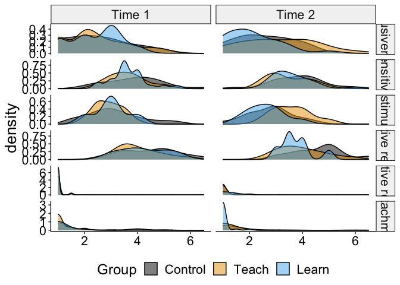
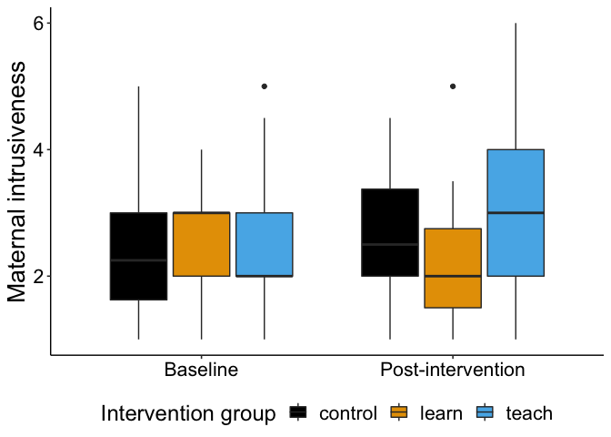
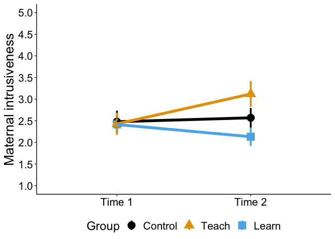
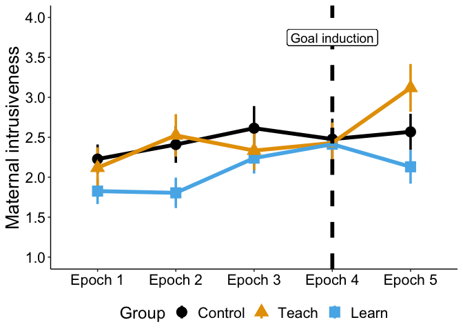
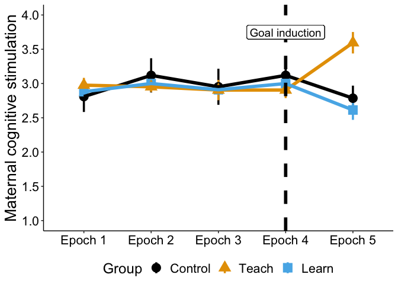
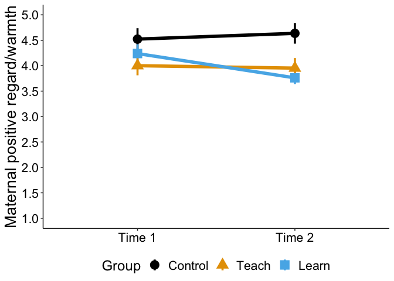
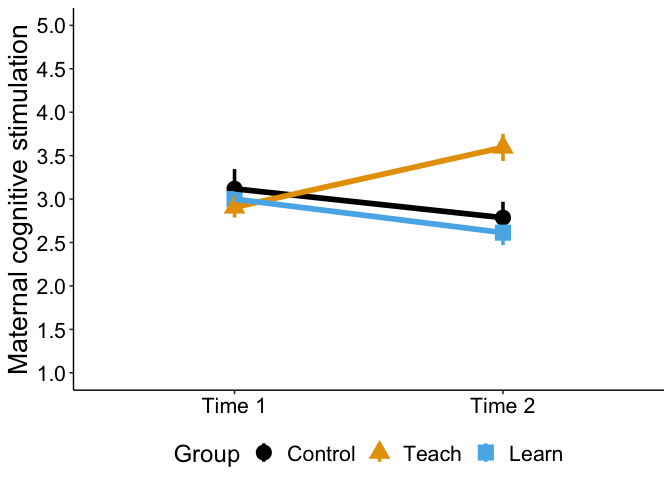
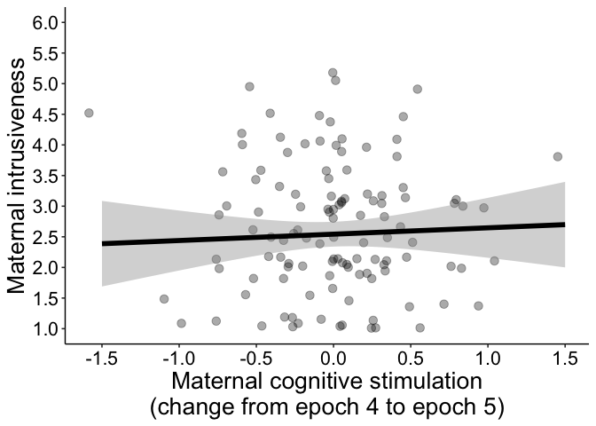
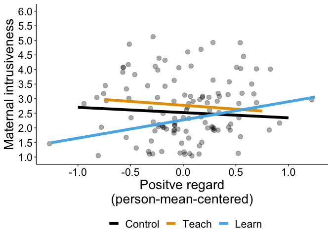

Analyses for Teaching and Learning from Baby: Inducing Explicit
Parenting Goals Influences Caregiver Intrusiveness
================
Lucy S. King
2020

-   [Environment](#environment)
-   [Randomly pick control dyads to match sample size of largest
    treatment
    group](#randomly-pick-control-dyads-to-match-sample-size-of-largest-treatment-group)
-   [Read in data](#read-in-data)
-   [Cell sizes](#cell-sizes)
-   [Examine missingness](#examine-missingness)
-   [Descriptive statistics](#descriptive-statistics)
    -   [Sample characteristics table](#sample-characteristics-table)
    -   [Reliability](#reliability)
    -   [Distributions of caregiving
        behaviors](#distributions-of-caregiving-behaviors)
    -   [Examine matching across
        groups](#examine-matching-across-groups)
-   [Test pre-registered hypotheses](#test-pre-registered-hypotheses)
    -   [Dummy-code episode and group](#dummy-code-episode-and-group)
    -   [Omnibus interaction effect with control group as
        baseline](#omnibus-interaction-effect-with-control-group-as-baseline)
    -   [Simple effects](#simple-effects)
    -   [learn group as baseline](#learn-group-as-baseline)
    -   [teach group as baseline](#teach-group-as-baseline)
    -   [Visualize zero-order effects](#visualize-zero-order-effects)
    -   [N (%) increased, descreased,
        etc.](#n--increased-descreased-etc)
-   [Additional analyses](#additional-analyses)
    -   [Covarying for infant sex and only
        child](#covarying-for-infant-sex-and-only-child)
    -   [Using all free play data](#using-all-free-play-data)
    -   [Other caregiving behaviors](#other-caregiving-behaviors)

Please refer to
<https://osf.io/dt7ck?view_only=4381f7d2a4cf40b1abcf0b41f76cdf63> for
pre-registration.

# Environment

``` r
# Libraries
library(tidyverse)
```

    ## ── Attaching packages ─────────────────────────────────────── tidyverse 1.3.0 ──

    ## ✓ ggplot2 3.3.3     ✓ purrr   0.3.4
    ## ✓ tibble  3.1.2     ✓ dplyr   1.0.4
    ## ✓ tidyr   1.1.2     ✓ stringr 1.4.0
    ## ✓ readr   1.4.0     ✓ forcats 0.5.1

    ## ── Conflicts ────────────────────────────────────────── tidyverse_conflicts() ──
    ## x dplyr::filter() masks stats::filter()
    ## x dplyr::lag()    masks stats::lag()

``` r
library(ggsci)
library(ggpubr)
library(car)
```

    ## Loading required package: carData

    ## 
    ## Attaching package: 'car'

    ## The following object is masked from 'package:dplyr':
    ## 
    ##     recode

    ## The following object is masked from 'package:purrr':
    ## 
    ##     some

``` r
library(lme4)
```

    ## Loading required package: Matrix

    ## 
    ## Attaching package: 'Matrix'

    ## The following objects are masked from 'package:tidyr':
    ## 
    ##     expand, pack, unpack

    ## Registered S3 methods overwritten by 'lme4':
    ##   method                          from
    ##   cooks.distance.influence.merMod car 
    ##   influence.merMod                car 
    ##   dfbeta.influence.merMod         car 
    ##   dfbetas.influence.merMod        car

``` r
library(lmerTest)
```

    ## 
    ## Attaching package: 'lmerTest'

    ## The following object is masked from 'package:lme4':
    ## 
    ##     lmer

    ## The following object is masked from 'package:stats':
    ## 
    ##     step

``` r
library(performance)
library(effectsize)
library(parameters)
library(corrr)
set.seed(123456)

cbbPalette <- c("#000000", "#E69F00", "#56B4E9", "#009E73", "#F0E442", "#0072B2", "#D55E00", "#CC79A7")

# Data
data_home <- "~/Box/Mooddata_Coordinating/BABIES/Data/final_scored_data/"

assignment_file <- paste0(
  data_home, 
  "lab_caregiving_behavior/free_play_intervention_assignment.csv"
)

caregiving_file_lf <- paste0(
  data_home, 
  "lab_caregiving_behavior/free_play_lf_10min_20210106.csv"
)

caregiving_file_wf <- paste0(
  data_home, 
  "lab_caregiving_behavior/free_play_wf_10min_20210106.csv"
)

free_play_master_file <- paste0(
  data_home,
  "lab_caregiving_behavior/raw_data/PCIRS_FreePlay_MASTER_20200508.xlsx"
)

demographics_file <- paste0(
  data_home,
  "demographics/demo_6mo_cleaned_final.csv"
)

cesd_file <- paste0(
  data_home,
  "CESD/cesd_6mo_complete.csv"
)

shipley_file <- paste0(
  data_home,
  "shipley/shipley_6mo_final_20200208.csv"
)

crisys_file <- paste0(
  data_home,
  "CRISYS/crisys_scored_6mo_complete.csv"
)

ibq_file <- paste0(
  data_home,
  "IBQ/ibq_scored_final.csv"
)

knitr::opts_chunk$set(warning=FALSE, message=FALSE)
```

# Randomly pick control dyads to match sample size of largest treatment group

Inclusion criteria: infant showed no significant fussiness during last
two epochs of free play

``` r
all_fp_data <-
  read_csv(caregiving_file_lf) %>% 
  filter(!is.na(intrus_FP)) %>% 
  distinct(ID) # plus 3 never coded

possible_controls <- #
  read_csv(caregiving_file_lf) %>% 
  left_join(read_csv(assignment_file), by = "ID") %>% 
  left_join(read_csv(demographics_file) %>% select(ID, behav_visit_date),  by = "ID") %>% 
  filter(is.na(group)) %>% 
  filter(!ID %in% c(126, 129, 131, 137, 1059, 1062, 1066, 1070, 1077)) # these IDs attempted intervention but were ultimately excluded (infant distress, diaper changing, did not understand instructions)

possible_controls_n <- possible_controls %>% summarise(n_distinct(ID)) %>% pull() # plus 1 never coded

possible_controls %>% 
  filter(episode >= 4, negmood_FP > 2.5) %>% 
  summarise(n_distinct(ID))
```

    ## # A tibble: 1 x 1
    ##   `n_distinct(ID)`
    ##              <int>
    ## 1               27

``` r
controls <-
  possible_controls %>% 
  filter(episode >= 4) %>% 
  filter(negmood_FP < 3) %>% 
  distinct(ID) %>% 
  sample_n(size = 22) %>% 
  mutate(group = "control")

assignment <-
  read_csv(assignment_file) %>% 
  bind_rows(controls)
```

# Read in data

``` r
d.0 <-
  read_csv(caregiving_file_lf) %>% 
  left_join(assignment, by = "ID") %>% 
  left_join(read_csv(demographics_file), by = "ID") %>% 
  left_join(read_csv(cesd_file), by = "ID") %>% 
  left_join(read_csv(shipley_file), by = "ID") %>% 
  left_join(read_csv(crisys_file), by = "ID") %>% 
  left_join(read_csv(ibq_file), by = "ID") %>% 
  mutate(
    male = as.factor(male),
    group = as.factor(group),
    episode_f = as.factor(episode),
    college_or_higher = fct_collapse(
      education_txt,
      below = c(
        "Trade/technical/vocational training",
        "Associate degree",
        "High school graduate/diploma/equivalent (i.e. GED)",
        "Some college credit, no degree"
      ),
      college_or_higher = c(
        "Bachelor's degree",
        "Graduate degree"
      )
    ),
    only_child = as.factor(
      if_else(
        ppl_in_home_allchild > 1,
        "not", "only child"
      )
    ),
    poc = if_else(
      mom_race != "White" | mom_latinx == 1,
      "POC", "White, Non-Hispanic"
    )
  ) 

da.0 <-
  d.0 %>% 
  filter(episode >= 4)

# data with only those included in teach/learn analyses
d <-
  d.0 %>% 
  filter(!is.na(group)) 
  

da <-
  d %>% 
  filter(episode >= 4)
```

``` r
d_wf.0 <-
  read_csv(caregiving_file_wf) %>% 
  left_join(assignment, by = "ID") %>% 
  left_join(read_csv(demographics_file), by = "ID") %>% 
  left_join(read_csv(cesd_file), by = "ID") %>% 
  left_join(read_csv(shipley_file), by = "ID") %>% 
  left_join(read_csv(crisys_file), by = "ID") %>% 
  left_join(read_csv(ibq_file), by = "ID") %>% 
  mutate(
    male = as.factor(male),
    group = as.factor(group),
    college_or_higher = fct_collapse(
      education_txt,
      below = c(
        "Trade/technical/vocational training",
        "Associate degree",
        "High school graduate/diploma/equivalent (i.e. GED)",
        "Some college credit, no degree"
      ),
      college_or_higher = c(
        "Bachelor's degree",
        "Graduate degree"
      )
    ),
    only_child = as.factor(
      if_else(
        ppl_in_home_allchild > 1,
        "not", "only child"
      )
    ),
    poc = if_else(
      mom_race != "White" | mom_latinx == 1,
      "POC", "White, Non-Hispanic"
    )
  )

# data with only those included in teach/learn analyses
d_wf <-
  read_csv(caregiving_file_wf) %>% 
  left_join(assignment, by = "ID") %>% 
  filter(!is.na(group)) %>% 
  left_join(read_csv(demographics_file), by = "ID") %>% 
  left_join(read_csv(cesd_file), by = "ID") %>% 
  left_join(read_csv(shipley_file), by = "ID") %>% 
  left_join(read_csv(crisys_file), by = "ID") %>% 
  left_join(read_csv(ibq_file), by = "ID") %>% 
  mutate(
    male = as.factor(male),
    group = as.factor(group),
    college_or_higher = fct_collapse(
      education_txt,
      below = c(
        "Trade/technical/vocational training",
        "Associate degree",
        "High school graduate/diploma/equivalent (i.e. GED)",
        "Some college credit, no degree"
      ),
      college_or_higher = c(
        "Bachelor's degree",
        "Graduate degree"
      )
    ),
    only_child = as.factor(
      if_else(
        ppl_in_home_allchild > 1,
        "not", "only child"
      )
    ),
    poc = if_else(
      mom_race != "White" | mom_latinx == 1,
      "POC", "White, Non-Hispanic"
    )
  )
```

``` r
fp_master <-
  readxl::read_xlsx(free_play_master_file) %>% 
  mutate_at(
    vars(Sens_R2:NegMood_R2, Sens_R1:NegMood_R1),
    funs(as.double)
  ) %>% 
  rename_at(
    vars(Sens_R2:NegMood_R2, Sens_R1:NegMood_R1),
    funs(str_to_lower)
  ) 
```

# Cell sizes

``` r
d %>% 
  distinct(ID, .keep_all = TRUE) %>% 
  count(group)
```

    ## # A tibble: 3 x 2
    ##   group       n
    ## * <fct>   <int>
    ## 1 control    22
    ## 2 learn      23
    ## 3 teach      21

# Examine missingness

``` r
d_wf %>% 
  count(is.na(mom_age))
```

    ## # A tibble: 1 x 2
    ##   `is.na(mom_age)`     n
    ## * <lgl>            <int>
    ## 1 FALSE               66

``` r
d_wf %>% 
  count(is.na(ppl_in_home_allchild))
```

    ## # A tibble: 1 x 2
    ##   `is.na(ppl_in_home_allchild)`     n
    ## * <lgl>                         <int>
    ## 1 FALSE                            66

``` r
d_wf %>% 
  count(is.na(education))
```

    ## # A tibble: 1 x 2
    ##   `is.na(education)`     n
    ## * <lgl>              <int>
    ## 1 FALSE                 66

``` r
d_wf %>% 
  count(group, is.na(cesd_total))
```

    ## # A tibble: 3 x 3
    ##   group   `is.na(cesd_total)`     n
    ##   <fct>   <lgl>               <int>
    ## 1 control FALSE                  22
    ## 2 learn   FALSE                  23
    ## 3 teach   FALSE                  21

``` r
d_wf %>% 
  count(group, is.na(crisys_total))
```

    ## # A tibble: 5 x 3
    ##   group   `is.na(crisys_total)`     n
    ##   <fct>   <lgl>                 <int>
    ## 1 control FALSE                    19
    ## 2 control TRUE                      3
    ## 3 learn   FALSE                    23
    ## 4 teach   FALSE                    19
    ## 5 teach   TRUE                      2

``` r
d_wf %>% 
  count(group, is.na(NEG))
```

    ## # A tibble: 5 x 3
    ##   group   `is.na(NEG)`     n
    ##   <fct>   <lgl>        <int>
    ## 1 control FALSE           19
    ## 2 control TRUE             3
    ## 3 learn   FALSE           23
    ## 4 teach   FALSE           19
    ## 5 teach   TRUE             2

# Descriptive statistics

## Sample characteristics table

``` r
d_sample_means <-
  d_wf %>% 
  group_by(group) %>% 
  summarise_at(
    vars(
      age_behav,
      mom_age,
      income_needs,
      cesd_total,
      crisys_total,
      NEG
    ),
    funs(mean), na.rm = TRUE
  ) %>% 
  gather(variable, mean, -group)

d_sample_sds <-
  d_wf %>% 
  group_by(group) %>% 
  summarise_at(
    vars(
      age_behav,
      mom_age,
      income_needs,
      cesd_total,
      crisys_total,
      NEG
    ),
    funs(sd), na.rm = TRUE
  ) %>% 
  gather(variable, sd, -group)

d_sample_mins <-
  d_wf %>% 
  group_by(group) %>% 
  summarise_at(
    vars(
      age_behav,
      mom_age,
      income_needs,
      cesd_total,
      crisys_total,
      NEG
    ),
    funs(min), na.rm = TRUE
  ) %>% 
  gather(variable, min, -group)

d_sample_maxs <-
  d_wf %>% 
  group_by(group) %>% 
  summarise_at(
    vars(
      age_behav,
      mom_age,
      income_needs,
      cesd_total,
      crisys_total,
      NEG
    ),
    funs(max), na.rm = TRUE
  ) %>% 
  gather(variable, max, -group)

d_sample_means %>% 
  left_join(d_sample_sds, by = c("group", "variable")) %>% 
  left_join(d_sample_mins, by = c("group", "variable"))  %>% 
  left_join(d_sample_maxs, by = c("group", "variable")) %>% 
  pivot_wider(
    names_from = group,
    values_from = mean:max
  )  %>% 
  mutate_at(
    vars(mean_control:max_teach),
    funs(round(., 2))
  ) %>% 
  mutate(
    mean_control = paste(mean_control, sd_control, sep = ", "),
    mean_teach = paste(mean_teach, sd_teach, sep = ", "),
    mean_learn = paste(mean_learn, sd_learn, sep = ", ")
  )
```

    ## # A tibble: 6 x 13
    ##   variable     mean_control mean_learn  mean_teach  sd_control sd_learn sd_teach
    ##   <chr>        <chr>        <chr>       <chr>            <dbl>    <dbl>    <dbl>
    ## 1 age_behav    6.11, 0.51   6.21, 0.38  6.06, 0.28        0.51     0.38     0.28
    ## 2 mom_age      35.2, 4.12   32.23, 5.53 32.62, 3.59       4.12     5.53     3.59
    ## 3 income_needs 1.52, 0.46   1.49, 0.55  1.54, 0.47        0.46     0.55     0.47
    ## 4 cesd_total   9.32, 7.45   12.48, 9.89 8.38, 7.45        7.45     9.89     7.45
    ## 5 crisys_total 5.45, 3.34   7.1, 6.39   5.65, 3.59        3.34     6.39     3.59
    ## 6 NEG          3.17, 0.66   3.26, 0.78  3.03, 0.72        0.66     0.78     0.72
    ## # … with 6 more variables: min_control <dbl>, min_learn <dbl>, min_teach <dbl>,
    ## #   max_control <dbl>, max_learn <dbl>, max_teach <dbl>

``` r
d_wf %>% 
  count(group, college_or_higher) %>% 
  pivot_wider(
    names_from = group,
    values_from = n
  )
```

    ## # A tibble: 2 x 4
    ##   college_or_higher control learn teach
    ##   <fct>               <int> <int> <int>
    ## 1 below                   1     6     2
    ## 2 college_or_higher      21    17    19

``` r
d_wf %>% 
  count(group, mom_race) %>% 
  arrange(group, desc(n)) %>% 
  pivot_wider(
    names_from = group,
    values_from = n
  )
```

    ## # A tibble: 5 x 4
    ##   mom_race                               control learn teach
    ##   <chr>                                    <int> <int> <int>
    ## 1 White                                       12    14    12
    ## 2 Asian                                        6     4     8
    ## 3 Other                                        3     3     1
    ## 4 Native Hawaiian/Other Pacific Islander       1     1    NA
    ## 5 Black/African American                      NA     1    NA

``` r
d_wf %>% 
  count(group, mom_latinx) %>% 
  pivot_wider(
    names_from = group,
    values_from = n
  )
```

    ## # A tibble: 3 x 4
    ##   mom_latinx control learn teach
    ##        <dbl>   <int> <int> <int>
    ## 1          0      18    20    19
    ## 2          1       3     3     2
    ## 3         NA       1    NA    NA

``` r
d_wf %>% 
  count(group, male) %>% 
  pivot_wider(
    names_from = group,
    values_from = n
  )
```

    ## # A tibble: 2 x 4
    ##   male  control learn teach
    ##   <fct>   <int> <int> <int>
    ## 1 0           9    12    11
    ## 2 1          13    11    10

``` r
d_wf %>% 
  count(group, only_child) %>% 
  pivot_wider(
    names_from = group,
    values_from = n
  )
```

    ## # A tibble: 2 x 4
    ##   only_child control learn teach
    ##   <fct>        <int> <int> <int>
    ## 1 not              9    13    11
    ## 2 only child      13    10    10

## Reliability

### Covariates

``` r
d_wf %>% 
  dplyr::select(
    cesd_1:cesd_20
  ) %>% 
  psych::alpha()
```

    ## 
    ## Reliability analysis   
    ## Call: psych::alpha(x = .)
    ## 
    ##   raw_alpha std.alpha G6(smc) average_r S/N   ase mean   sd median_r
    ##       0.89      0.89    0.94      0.29   8 0.019 0.51 0.42     0.29
    ## 
    ##  lower alpha upper     95% confidence boundaries
    ## 0.85 0.89 0.92 
    ## 
    ##  Reliability if an item is dropped:
    ##         raw_alpha std.alpha G6(smc) average_r S/N alpha se var.r med.r
    ## cesd_1       0.88      0.88    0.94      0.29 7.7    0.020 0.032  0.29
    ## cesd_2       0.88      0.88    0.94      0.29 7.7    0.019 0.032  0.30
    ## cesd_3       0.88      0.88    0.93      0.28 7.3    0.020 0.033  0.28
    ## cesd_4       0.88      0.88    0.94      0.29 7.7    0.019 0.033  0.30
    ## cesd_5       0.88      0.88    0.94      0.29 7.7    0.020 0.033  0.30
    ## cesd_6       0.87      0.88    0.93      0.27 7.2    0.021 0.032  0.27
    ## cesd_7       0.88      0.88    0.94      0.28 7.6    0.020 0.034  0.28
    ## cesd_8       0.88      0.88    0.93      0.29 7.6    0.019 0.031  0.29
    ## cesd_9       0.89      0.89    0.94      0.30 8.2    0.019 0.031  0.30
    ## cesd_10      0.88      0.88    0.94      0.29 7.7    0.020 0.030  0.29
    ## cesd_11      0.89      0.89    0.94      0.29 7.9    0.019 0.033  0.30
    ## cesd_12      0.89      0.89    0.94      0.30 8.0    0.019 0.029  0.30
    ## cesd_13      0.88      0.88    0.93      0.29 7.6    0.020 0.032  0.28
    ## cesd_14      0.88      0.88    0.93      0.28 7.2    0.021 0.033  0.27
    ## cesd_15      0.88      0.89    0.94      0.30 8.0    0.019 0.031  0.30
    ## cesd_16      0.89      0.89    0.93      0.29 7.8    0.019 0.030  0.30
    ## cesd_17      0.88      0.88    0.94      0.29 7.7    0.020 0.034  0.30
    ## cesd_18      0.87      0.87    0.93      0.27 6.9    0.022 0.030  0.27
    ## cesd_19      0.88      0.88    0.93      0.28 7.4    0.020 0.031  0.29
    ## cesd_20      0.88      0.88    0.93      0.28 7.4    0.020 0.033  0.28
    ## 
    ##  Item statistics 
    ##          n raw.r std.r r.cor r.drop  mean   sd
    ## cesd_1  66  0.60  0.55  0.52   0.53 0.712 0.84
    ## cesd_2  66  0.49  0.53  0.51   0.43 0.258 0.64
    ## cesd_3  66  0.67  0.70  0.69   0.63 0.303 0.55
    ## cesd_4  66  0.47  0.53  0.51   0.42 0.227 0.55
    ## cesd_5  66  0.60  0.53  0.51   0.52 1.197 1.01
    ## cesd_6  66  0.73  0.75  0.75   0.68 0.424 0.75
    ## cesd_7  66  0.61  0.59  0.56   0.53 1.076 1.03
    ## cesd_8  66  0.48  0.58  0.57   0.43 0.167 0.45
    ## cesd_9  66  0.25  0.31  0.28   0.21 0.106 0.31
    ## cesd_10 66  0.59  0.53  0.51   0.52 0.409 0.80
    ## cesd_11 66  0.53  0.46  0.42   0.42 1.303 1.15
    ## cesd_12 66  0.33  0.42  0.40   0.28 0.182 0.46
    ## cesd_13 66  0.61  0.57  0.56   0.54 0.530 0.86
    ## cesd_14 66  0.71  0.72  0.71   0.66 0.697 0.84
    ## cesd_15 66  0.42  0.41  0.38   0.35 0.318 0.66
    ## cesd_16 66  0.39  0.49  0.48   0.35 0.091 0.34
    ## cesd_17 66  0.52  0.54  0.52   0.46 0.318 0.61
    ## cesd_18 66  0.86  0.84  0.85   0.82 0.818 0.93
    ## cesd_19 66  0.66  0.63  0.63   0.61 0.379 0.76
    ## cesd_20 66  0.67  0.66  0.64   0.61 0.606 0.80
    ## 
    ## Non missing response frequency for each item
    ##            0    1    2    3 miss
    ## cesd_1  0.47 0.41 0.06 0.06    0
    ## cesd_2  0.82 0.14 0.02 0.03    0
    ## cesd_3  0.74 0.21 0.05 0.00    0
    ## cesd_4  0.83 0.11 0.06 0.00    0
    ## cesd_5  0.27 0.41 0.17 0.15    0
    ## cesd_6  0.71 0.17 0.11 0.02    0
    ## cesd_7  0.33 0.41 0.11 0.15    0
    ## cesd_8  0.86 0.11 0.03 0.00    0
    ## cesd_9  0.89 0.11 0.00 0.00    0
    ## cesd_10 0.73 0.20 0.02 0.06    0
    ## cesd_11 0.32 0.29 0.17 0.23    0
    ## cesd_12 0.85 0.12 0.03 0.00    0
    ## cesd_13 0.65 0.23 0.06 0.06    0
    ## cesd_14 0.50 0.35 0.11 0.05    0
    ## cesd_15 0.76 0.20 0.02 0.03    0
    ## cesd_16 0.92 0.06 0.02 0.00    0
    ## cesd_17 0.74 0.21 0.03 0.02    0
    ## cesd_18 0.44 0.39 0.08 0.09    0
    ## cesd_19 0.74 0.18 0.03 0.05    0
    ## cesd_20 0.55 0.35 0.06 0.05    0

``` r
d_wf %>% 
  dplyr::select(
    crisys_1:crisys_68
  ) %>% 
  psych::alpha()
```

    ## Some items ( crisys_1 crisys_21 crisys_23 crisys_26 crisys_31 crisys_32 crisys_33 crisys_35 crisys_39 crisys_40 crisys_41 crisys_45 crisys_48 crisys_49 crisys_50 crisys_53 crisys_54 crisys_55 crisys_56 crisys_62 ) were negatively correlated with the total scale and 
    ## probably should be reversed.  
    ## To do this, run the function again with the 'check.keys=TRUE' option

    ## 
    ## Reliability analysis   
    ## Call: psych::alpha(x = .)
    ## 
    ##   raw_alpha std.alpha G6(smc) average_r S/N   ase mean    sd median_r
    ##       0.79      0.85    0.95     0.092 5.8 0.036 0.08 0.064   -0.024
    ## 
    ##  lower alpha upper     95% confidence boundaries
    ## 0.72 0.79 0.86 
    ## 
    ##  Reliability if an item is dropped:
    ##           raw_alpha std.alpha G6(smc) average_r S/N alpha se var.r  med.r
    ## crisys_1       0.80      0.86    0.95     0.096 6.0    0.034 0.052 -0.024
    ## crisys_2       0.79      0.85    0.95     0.092 5.8    0.037 0.052 -0.024
    ## crisys_3       0.79      0.85    0.95     0.091 5.7    0.036 0.052 -0.024
    ## crisys_4       0.79      0.85    0.95     0.092 5.8    0.036 0.052 -0.024
    ## crisys_5       0.78      0.84    0.95     0.086 5.4    0.037 0.048 -0.024
    ## crisys_6       0.78      0.85    0.95     0.089 5.5    0.037 0.050 -0.024
    ## crisys_7       0.78      0.84    0.95     0.086 5.4    0.037 0.048 -0.024
    ## crisys_8       0.78      0.84    0.95     0.087 5.4    0.037 0.049 -0.024
    ## crisys_9       0.78      0.85    0.95     0.089 5.5    0.037 0.050 -0.024
    ## crisys_10      0.79      0.86    0.95     0.094 5.9    0.036 0.052 -0.024
    ## crisys_12      0.78      0.84    0.95     0.086 5.4    0.037 0.048 -0.024
    ## crisys_13      0.78      0.84    0.95     0.086 5.4    0.037 0.048 -0.024
    ## crisys_14      0.78      0.85    0.94     0.088 5.5    0.037 0.050 -0.024
    ## crisys_15      0.78      0.85    0.95     0.089 5.6    0.037 0.050 -0.024
    ## crisys_16      0.78      0.85    0.95     0.089 5.6    0.037 0.051 -0.024
    ## crisys_17      0.78      0.85    0.95     0.088 5.5    0.037 0.050 -0.024
    ## crisys_18      0.78      0.85    0.95     0.087 5.5    0.037 0.050 -0.024
    ## crisys_19      0.78      0.85    0.95     0.087 5.5    0.037 0.050 -0.024
    ## crisys_21      0.79      0.86    0.96     0.094 5.9    0.036 0.052 -0.024
    ## crisys_22      0.78      0.85    0.94     0.091 5.7    0.037 0.052 -0.024
    ## crisys_23      0.79      0.85    0.95     0.093 5.9    0.036 0.052 -0.024
    ## crisys_25      0.80      0.86    0.95     0.094 5.9    0.035 0.052 -0.024
    ## crisys_26      0.79      0.85    0.95     0.093 5.8    0.036 0.051 -0.024
    ## crisys_27      0.78      0.85    0.95     0.092 5.8    0.037 0.052 -0.024
    ## crisys_28      0.79      0.85    0.95     0.092 5.8    0.037 0.052 -0.024
    ## crisys_29      0.78      0.85    0.95     0.091 5.7    0.037 0.052 -0.024
    ## crisys_31      0.79      0.85    0.95     0.093 5.8    0.036 0.051 -0.024
    ## crisys_32      0.80      0.86    0.95     0.095 6.0    0.034 0.052 -0.024
    ## crisys_33      0.80      0.86    0.95     0.096 6.0    0.035 0.052 -0.024
    ## crisys_34      0.79      0.85    0.95     0.094 5.9    0.035 0.052 -0.024
    ## crisys_35      0.79      0.86    0.95     0.094 5.9    0.035 0.052 -0.024
    ## crisys_36      0.79      0.86    0.95     0.094 5.9    0.036 0.052 -0.024
    ## crisys_37      0.79      0.86    0.95     0.095 6.0    0.036 0.052 -0.024
    ## crisys_39      0.79      0.86    0.95     0.095 6.0    0.035 0.052 -0.024
    ## crisys_40      0.79      0.86    0.95     0.095 6.0    0.036 0.052 -0.024
    ## crisys_41      0.79      0.86    0.95     0.095 6.0    0.036 0.052 -0.024
    ## crisys_44      0.79      0.86    0.95     0.094 5.9    0.036 0.052 -0.024
    ## crisys_45      0.79      0.85    0.95     0.093 5.8    0.036 0.051 -0.024
    ## crisys_48      0.79      0.86    0.95     0.095 6.0    0.036 0.052 -0.024
    ## crisys_49      0.79      0.86    0.95     0.094 5.9    0.036 0.052 -0.024
    ## crisys_50      0.79      0.86    0.95     0.094 5.9    0.036 0.052 -0.024
    ## crisys_51      0.79      0.85    0.95     0.093 5.9    0.036 0.052 -0.024
    ## crisys_53      0.79      0.85    0.95     0.093 5.9    0.035 0.052 -0.024
    ## crisys_54      0.79      0.85    0.94     0.093 5.9    0.036 0.052 -0.024
    ## crisys_55      0.80      0.86    0.95     0.096 6.0    0.035 0.052 -0.024
    ## crisys_56      0.79      0.86    0.94     0.094 5.9    0.036 0.052 -0.024
    ## crisys_57      0.78      0.85    0.94     0.090 5.6    0.037 0.052 -0.024
    ## crisys_58      0.79      0.85    0.94     0.092 5.7    0.037 0.052 -0.024
    ## crisys_59      0.79      0.85    0.95     0.090 5.6    0.037 0.051 -0.024
    ## crisys_60      0.78      0.85    0.95     0.089 5.6    0.037 0.051 -0.024
    ## crisys_61      0.78      0.84    0.95     0.086 5.4    0.037 0.048 -0.024
    ## crisys_62      0.79      0.85    0.95     0.093 5.9    0.036 0.052 -0.024
    ## crisys_63      0.78      0.85    0.95     0.088 5.5    0.037 0.050 -0.024
    ## crisys_64      0.79      0.85    0.95     0.093 5.8    0.036 0.052 -0.024
    ## crisys_65      0.78      0.85    0.95     0.089 5.5    0.037 0.051 -0.024
    ## crisys_66      0.78      0.84    0.95     0.086 5.4    0.037 0.048 -0.024
    ## crisys_67      0.79      0.86    0.95     0.094 5.9    0.036 0.052 -0.024
    ## crisys_68      0.79      0.85    0.95     0.092 5.8    0.036 0.053 -0.024
    ## 
    ##  Item statistics 
    ##            n  raw.r   std.r   r.cor r.drop  mean   sd
    ## crisys_1  61  0.033 -0.0332 -0.0515 -0.066 0.230 0.42
    ## crisys_2  61  0.368  0.2910  0.2842  0.320 0.049 0.22
    ## crisys_3  61  0.350  0.3512  0.3506  0.271 0.180 0.39
    ## crisys_4  61  0.274  0.3069  0.3063  0.186 0.213 0.41
    ## crisys_5  61  0.674  0.7953  0.7621  0.660 0.016 0.13
    ## crisys_6  61  0.450  0.5627  0.5717  0.419 0.033 0.18
    ## crisys_7  60  0.674  0.8005  0.7674  0.664 0.017 0.13
    ## crisys_8  61  0.620  0.6917  0.7041  0.596 0.033 0.18
    ## crisys_9  61  0.493  0.5797  0.5774  0.463 0.033 0.18
    ## crisys_10 61  0.136  0.1105  0.0988  0.092 0.033 0.18
    ## crisys_12 61  0.674  0.7953  0.7621  0.660 0.016 0.13
    ## crisys_13 60  0.674  0.8006  0.7676  0.664 0.017 0.13
    ## crisys_14 61  0.574  0.6216  0.6342  0.541 0.049 0.22
    ## crisys_15 61  0.486  0.5587  0.5686  0.449 0.049 0.22
    ## crisys_16 61  0.512  0.5469  0.5533  0.468 0.066 0.25
    ## crisys_17 60  0.522  0.5814  0.5563  0.485 0.050 0.22
    ## crisys_18 61  0.620  0.6810  0.6448  0.596 0.033 0.18
    ## crisys_19 61  0.620  0.6810  0.6448  0.596 0.033 0.18
    ## crisys_21 61  0.077  0.0920  0.0821  0.048 0.016 0.13
    ## crisys_22 61  0.455  0.3956  0.3997  0.372 0.230 0.42
    ## crisys_23 61  0.156  0.1748  0.1743  0.116 0.033 0.18
    ## crisys_25 61  0.197  0.0847  0.0759  0.097 0.246 0.43
    ## crisys_26 61  0.137  0.2001  0.1917  0.109 0.016 0.13
    ## crisys_27 61  0.423  0.3043  0.3044  0.327 0.328 0.47
    ## crisys_28 61  0.401  0.3027  0.3040  0.297 0.443 0.50
    ## crisys_29 61  0.423  0.4042  0.4028  0.345 0.180 0.39
    ## crisys_31 61  0.137  0.2001  0.1917  0.109 0.016 0.13
    ## crisys_32 61  0.055  0.0071 -0.0069 -0.033 0.180 0.39
    ## crisys_33 61  0.012 -0.0125 -0.0254 -0.058 0.098 0.30
    ## crisys_34 61  0.185  0.1479  0.1486  0.101 0.164 0.37
    ## crisys_35 61  0.113  0.1073  0.1011  0.056 0.066 0.25
    ## crisys_36 61  0.077  0.1055  0.0981  0.048 0.016 0.13
    ## crisys_37 61  0.047  0.0466  0.0396  0.018 0.016 0.13
    ## crisys_39 60  0.023  0.0298  0.0224 -0.018 0.033 0.18
    ## crisys_40 61  0.068  0.0657  0.0630  0.026 0.033 0.18
    ## crisys_41 61  0.018  0.0388  0.0319 -0.012 0.016 0.13
    ## crisys_44 61  0.131  0.1205  0.1199  0.091 0.033 0.18
    ## crisys_45 60  0.145  0.2036  0.1549  0.114 0.017 0.13
    ## crisys_48 61  0.144  0.0667  0.0621  0.088 0.066 0.25
    ## crisys_49 60  0.165  0.0915  0.0893  0.103 0.083 0.28
    ## crisys_50 61  0.129  0.0773  0.0712  0.072 0.066 0.25
    ## crisys_51 61  0.195  0.1795  0.1527  0.155 0.033 0.18
    ## crisys_53 61  0.174  0.1761  0.1750  0.084 0.197 0.40
    ## crisys_54 60  0.173  0.1836  0.1825  0.125 0.050 0.22
    ## crisys_55 61 -0.015 -0.0340 -0.0585 -0.086 0.098 0.30
    ## crisys_56 60  0.181  0.1224  0.1215  0.138 0.033 0.18
    ## crisys_57 60  0.444  0.4678  0.4788  0.379 0.133 0.34
    ## crisys_58 61  0.356  0.3240  0.3283  0.273 0.197 0.40
    ## crisys_59 60  0.401  0.4823  0.4873  0.361 0.050 0.22
    ## crisys_60 61  0.497  0.5072  0.5166  0.453 0.066 0.25
    ## crisys_61 61  0.674  0.7953  0.7621  0.660 0.016 0.13
    ## crisys_62 61  0.250  0.1914  0.1927  0.188 0.082 0.28
    ## crisys_63 61  0.535  0.6424  0.6434  0.507 0.033 0.18
    ## crisys_64 61  0.334  0.2165  0.2133  0.250 0.180 0.39
    ## crisys_65 60  0.524  0.5695  0.5690  0.490 0.050 0.22
    ## crisys_66 61  0.674  0.7953  0.7621  0.660 0.016 0.13
    ## crisys_67 61  0.137  0.1192  0.1135  0.109 0.016 0.13
    ## crisys_68 61  0.338  0.2716  0.2627  0.232 0.607 0.49
    ## 
    ## Non missing response frequency for each item
    ##              0    1 miss
    ## crisys_1  0.77 0.23 0.08
    ## crisys_2  0.95 0.05 0.08
    ## crisys_3  0.82 0.18 0.08
    ## crisys_4  0.79 0.21 0.08
    ## crisys_5  0.98 0.02 0.08
    ## crisys_6  0.97 0.03 0.08
    ## crisys_7  0.98 0.02 0.09
    ## crisys_8  0.97 0.03 0.08
    ## crisys_9  0.97 0.03 0.08
    ## crisys_10 0.97 0.03 0.08
    ## crisys_12 0.98 0.02 0.08
    ## crisys_13 0.98 0.02 0.09
    ## crisys_14 0.95 0.05 0.08
    ## crisys_15 0.95 0.05 0.08
    ## crisys_16 0.93 0.07 0.08
    ## crisys_17 0.95 0.05 0.09
    ## crisys_18 0.97 0.03 0.08
    ## crisys_19 0.97 0.03 0.08
    ## crisys_21 0.98 0.02 0.08
    ## crisys_22 0.77 0.23 0.08
    ## crisys_23 0.97 0.03 0.08
    ## crisys_25 0.75 0.25 0.08
    ## crisys_26 0.98 0.02 0.08
    ## crisys_27 0.67 0.33 0.08
    ## crisys_28 0.56 0.44 0.08
    ## crisys_29 0.82 0.18 0.08
    ## crisys_31 0.98 0.02 0.08
    ## crisys_32 0.82 0.18 0.08
    ## crisys_33 0.90 0.10 0.08
    ## crisys_34 0.84 0.16 0.08
    ## crisys_35 0.93 0.07 0.08
    ## crisys_36 0.98 0.02 0.08
    ## crisys_37 0.98 0.02 0.08
    ## crisys_39 0.97 0.03 0.09
    ## crisys_40 0.97 0.03 0.08
    ## crisys_41 0.98 0.02 0.08
    ## crisys_44 0.97 0.03 0.08
    ## crisys_45 0.98 0.02 0.09
    ## crisys_48 0.93 0.07 0.08
    ## crisys_49 0.92 0.08 0.09
    ## crisys_50 0.93 0.07 0.08
    ## crisys_51 0.97 0.03 0.08
    ## crisys_53 0.80 0.20 0.08
    ## crisys_54 0.95 0.05 0.09
    ## crisys_55 0.90 0.10 0.08
    ## crisys_56 0.97 0.03 0.09
    ## crisys_57 0.87 0.13 0.09
    ## crisys_58 0.80 0.20 0.08
    ## crisys_59 0.95 0.05 0.09
    ## crisys_60 0.93 0.07 0.08
    ## crisys_61 0.98 0.02 0.08
    ## crisys_62 0.92 0.08 0.08
    ## crisys_63 0.97 0.03 0.08
    ## crisys_64 0.82 0.18 0.08
    ## crisys_65 0.95 0.05 0.09
    ## crisys_66 0.98 0.02 0.08
    ## crisys_67 0.98 0.02 0.08
    ## crisys_68 0.39 0.61 0.08

``` r
d_wf %>% 
  dplyr::select(
    ibq_64, ibq_74, ibq_75, ibq_32, ibq_79, ibq_80,
    ibq_2, ibq_3_r, ibq_4, ibq_21, ibq_52, ibq_53, ibq_62,
    ibq_22, ibq_76, ibq_77, ibq_78, ibq_87, ibq_89,
    ibq_61_r, ibq_50_r, ibq_51, ibq_59, ibq_60_r, ibq_73_r
  ) %>% 
  psych::alpha()
```

    ## Some items ( ibq_61_r ibq_50_r ibq_60_r ibq_73_r ) were negatively correlated with the total scale and 
    ## probably should be reversed.  
    ## To do this, run the function again with the 'check.keys=TRUE' option

    ## 
    ## Reliability analysis   
    ## Call: psych::alpha(x = .)
    ## 
    ##   raw_alpha std.alpha G6(smc) average_r S/N   ase mean   sd median_r
    ##       0.79      0.78     0.9      0.12 3.4 0.035  3.9 0.64     0.11
    ## 
    ##  lower alpha upper     95% confidence boundaries
    ## 0.73 0.79 0.86 
    ## 
    ##  Reliability if an item is dropped:
    ##          raw_alpha std.alpha G6(smc) average_r S/N alpha se var.r med.r
    ## ibq_64        0.78      0.76    0.89      0.12 3.2    0.037 0.046  0.11
    ## ibq_74        0.79      0.77    0.89      0.12 3.3    0.036 0.048  0.11
    ## ibq_75        0.79      0.77    0.89      0.12 3.3    0.035 0.048  0.11
    ## ibq_32        0.79      0.77    0.90      0.12 3.4    0.035 0.047  0.11
    ## ibq_79        0.78      0.76    0.89      0.11 3.1    0.037 0.046  0.11
    ## ibq_80        0.78      0.76    0.89      0.12 3.1    0.037 0.047  0.10
    ## ibq_2         0.77      0.75    0.88      0.11 3.1    0.038 0.044  0.10
    ## ibq_3_r       0.78      0.76    0.88      0.12 3.2    0.037 0.046  0.11
    ## ibq_4         0.79      0.77    0.89      0.12 3.4    0.035 0.046  0.11
    ## ibq_21        0.80      0.78    0.90      0.13 3.6    0.034 0.045  0.12
    ## ibq_52        0.78      0.76    0.88      0.11 3.1    0.038 0.046  0.10
    ## ibq_53        0.77      0.75    0.88      0.11 3.0    0.039 0.045  0.10
    ## ibq_62        0.79      0.77    0.89      0.12 3.4    0.035 0.046  0.11
    ## ibq_22        0.80      0.78    0.90      0.13 3.6    0.033 0.047  0.13
    ## ibq_76        0.77      0.76    0.88      0.11 3.1    0.039 0.044  0.11
    ## ibq_77        0.77      0.75    0.88      0.11 3.1    0.039 0.044  0.11
    ## ibq_78        0.78      0.76    0.92      0.11 3.1    0.038 0.044  0.11
    ## ibq_87        0.79      0.77    0.89      0.12 3.4    0.036 0.044  0.11
    ## ibq_89        0.78      0.76    0.90      0.12 3.2    0.037 0.044  0.11
    ## ibq_61_r      0.80      0.78    0.89      0.13 3.5    0.034 0.046  0.12
    ## ibq_50_r      0.80      0.79    0.89      0.13 3.7    0.033 0.043  0.12
    ## ibq_51        0.79      0.77    0.89      0.12 3.3    0.035 0.046  0.11
    ## ibq_59        0.79      0.77    0.88      0.12 3.3    0.035 0.045  0.11
    ## ibq_60_r      0.80      0.78    0.89      0.13 3.6    0.034 0.043  0.12
    ## ibq_73_r      0.80      0.79    0.90      0.13 3.7    0.034 0.042  0.12
    ## 
    ##  Item statistics 
    ##           n raw.r std.r  r.cor  r.drop mean   sd
    ## ibq_64   55 0.583 0.528 0.5145  0.4599  4.1 1.89
    ## ibq_74   59 0.411 0.385 0.3470  0.3074  4.4 1.60
    ## ibq_75   55 0.360 0.380 0.3560  0.2891  2.5 1.40
    ## ibq_32   60 0.243 0.297 0.2394  0.2169  1.7 0.85
    ## ibq_79   60 0.605 0.568 0.5612  0.4867  3.8 1.70
    ## ibq_80   61 0.590 0.553 0.5331  0.4937  3.6 1.50
    ## ibq_2    60 0.624 0.630 0.6393  0.5938  3.9 1.44
    ## ibq_3_r  60 0.458 0.500 0.4998  0.4284  3.9 1.40
    ## ibq_4    61 0.357 0.350 0.3248  0.2611  4.1 1.59
    ## ibq_21   61 0.098 0.158 0.1178  0.0850  3.8 1.33
    ## ibq_52   61 0.598 0.579 0.5750  0.5281  4.5 1.53
    ## ibq_53   60 0.661 0.669 0.6761  0.6025  2.9 1.85
    ## ibq_62   55 0.378 0.346 0.3227  0.2767  4.0 1.66
    ## ibq_22   55 0.129 0.103 0.0423 -0.0092  4.0 1.65
    ## ibq_76   60 0.612 0.586 0.5917  0.5373  3.1 1.96
    ## ibq_77   56 0.618 0.613 0.6245  0.5591  2.4 1.89
    ## ibq_78   57 0.569 0.574 0.5695  0.5315  2.0 1.37
    ## ibq_87   57 0.332 0.325 0.3038  0.2829  1.6 0.96
    ## ibq_89   49 0.505 0.464 0.4067  0.4073  2.3 1.76
    ## ibq_61_r 57 0.204 0.253 0.2268  0.1186  5.6 1.33
    ## ibq_50_r 61 0.055 0.091 0.0618 -0.0636  5.3 1.46
    ## ibq_51   61 0.300 0.360 0.3335  0.2440  5.9 0.96
    ## ibq_59   61 0.284 0.376 0.3646  0.2506  6.1 1.08
    ## ibq_60_r 59 0.123 0.158 0.1258  0.0412  5.9 1.11
    ## ibq_73_r 57 0.014 0.039 0.0041 -0.0854  6.2 0.97
    ## 
    ## Non missing response frequency for each item
    ##             1    2    3    4    5    6    7 miss
    ## ibq_64   0.05 0.24 0.15 0.11 0.15 0.20 0.11 0.17
    ## ibq_74   0.02 0.15 0.14 0.17 0.22 0.24 0.07 0.11
    ## ibq_75   0.20 0.44 0.18 0.04 0.09 0.05 0.00 0.17
    ## ibq_32   0.43 0.50 0.03 0.02 0.00 0.02 0.00 0.09
    ## ibq_79   0.07 0.25 0.12 0.27 0.08 0.17 0.05 0.09
    ## ibq_80   0.03 0.28 0.16 0.26 0.11 0.13 0.02 0.08
    ## ibq_2    0.03 0.15 0.23 0.28 0.12 0.17 0.02 0.09
    ## ibq_3_r  0.00 0.20 0.20 0.33 0.10 0.13 0.03 0.09
    ## ibq_4    0.00 0.21 0.18 0.25 0.10 0.20 0.07 0.08
    ## ibq_21   0.02 0.16 0.30 0.18 0.23 0.11 0.00 0.08
    ## ibq_52   0.02 0.10 0.20 0.13 0.21 0.30 0.05 0.08
    ## ibq_53   0.30 0.18 0.22 0.05 0.13 0.07 0.05 0.09
    ## ibq_62   0.02 0.24 0.15 0.20 0.15 0.20 0.05 0.17
    ## ibq_22   0.02 0.22 0.20 0.20 0.13 0.16 0.07 0.17
    ## ibq_76   0.25 0.27 0.15 0.10 0.03 0.13 0.07 0.09
    ## ibq_77   0.48 0.27 0.04 0.02 0.04 0.14 0.02 0.15
    ## ibq_78   0.47 0.32 0.09 0.07 0.00 0.04 0.02 0.14
    ## ibq_87   0.60 0.28 0.07 0.02 0.04 0.00 0.00 0.14
    ## ibq_89   0.41 0.35 0.06 0.04 0.02 0.08 0.04 0.26
    ## ibq_61_r 0.00 0.04 0.04 0.14 0.14 0.35 0.30 0.14
    ## ibq_50_r 0.02 0.05 0.08 0.08 0.21 0.39 0.16 0.08
    ## ibq_51   0.00 0.00 0.02 0.10 0.11 0.51 0.26 0.08
    ## ibq_59   0.00 0.02 0.02 0.07 0.08 0.43 0.39 0.08
    ## ibq_60_r 0.00 0.03 0.02 0.03 0.12 0.53 0.27 0.11
    ## ibq_73_r 0.00 0.00 0.04 0.02 0.12 0.39 0.44 0.14

### Caregiving behavior

``` r
#intrusiveness
fp_master %>%
  filter(Episode < 4) %>% 
  dplyr::select(
    intrus_r1,
    intrus_r2
  ) %>% 
  na.omit() %>% 
  psych::ICC()
```

    ## Call: psych::ICC(x = .)
    ## 
    ## Intraclass correlation coefficients 
    ##                          type  ICC   F df1 df2       p lower bound upper bound
    ## Single_raters_absolute   ICC1 0.61 4.1  83  84 2.9e-10        0.48        0.71
    ## Single_random_raters     ICC2 0.61 4.1  83  83 3.5e-10        0.48        0.71
    ## Single_fixed_raters      ICC3 0.61 4.1  83  83 3.5e-10        0.48        0.71
    ## Average_raters_absolute ICC1k 0.76 4.1  83  84 2.9e-10        0.65        0.83
    ## Average_random_raters   ICC2k 0.76 4.1  83  83 3.5e-10        0.65        0.83
    ## Average_fixed_raters    ICC3k 0.76 4.1  83  83 3.5e-10        0.65        0.83
    ## 
    ##  Number of subjects = 84     Number of Judges =  2

``` r
#sensitivity
fp_master %>%
  filter(Episode < 4) %>% 
  dplyr::select(
    sens_r1,
    sens_r2
  ) %>% 
  na.omit() %>% 
  psych::ICC()
```

    ## Call: psych::ICC(x = .)
    ## 
    ## Intraclass correlation coefficients 
    ##                          type  ICC   F df1 df2       p lower bound upper bound
    ## Single_raters_absolute   ICC1 0.68 5.2  83  84 4.1e-13        0.57        0.76
    ## Single_random_raters     ICC2 0.68 5.3  83  83 4.1e-13        0.57        0.76
    ## Single_fixed_raters      ICC3 0.68 5.3  83  83 4.1e-13        0.57        0.77
    ## Average_raters_absolute ICC1k 0.81 5.2  83  84 4.1e-13        0.72        0.87
    ## Average_random_raters   ICC2k 0.81 5.3  83  83 4.1e-13        0.72        0.87
    ## Average_fixed_raters    ICC3k 0.81 5.3  83  83 4.1e-13        0.73        0.87
    ## 
    ##  Number of subjects = 84     Number of Judges =  2

``` r
#stimulation
fp_master %>%
  filter(Episode < 4) %>% 
  dplyr::select(
    stim_r1,
    stim_r2
  ) %>% 
  na.omit() %>% 
  psych::ICC()
```

    ## Call: psych::ICC(x = .)
    ## 
    ## Intraclass correlation coefficients 
    ##                          type  ICC   F df1 df2       p lower bound upper bound
    ## Single_raters_absolute   ICC1 0.72 6.2  83  84 2.7e-15        0.62        0.80
    ## Single_random_raters     ICC2 0.72 6.2  83  83 3.6e-15        0.62        0.80
    ## Single_fixed_raters      ICC3 0.72 6.2  83  83 3.6e-15        0.62        0.80
    ## Average_raters_absolute ICC1k 0.84 6.2  83  84 2.7e-15        0.77        0.89
    ## Average_random_raters   ICC2k 0.84 6.2  83  83 3.6e-15        0.77        0.89
    ## Average_fixed_raters    ICC3k 0.84 6.2  83  83 3.6e-15        0.77        0.89
    ## 
    ##  Number of subjects = 84     Number of Judges =  2

``` r
#positive regard
fp_master %>%
  filter(Episode < 4) %>% 
  dplyr::select(
    posreg_r1,
    posreg_r2
  ) %>% 
  na.omit() %>% 
  psych::ICC()
```

    ## Call: psych::ICC(x = .)
    ## 
    ## Intraclass correlation coefficients 
    ##                          type  ICC   F df1 df2       p lower bound upper bound
    ## Single_raters_absolute   ICC1 0.74 6.6  83  84 4.2e-16        0.64        0.81
    ## Single_random_raters     ICC2 0.74 8.1  83  83 5.7e-19        0.59        0.83
    ## Single_fixed_raters      ICC3 0.78 8.1  83  83 5.7e-19        0.70        0.84
    ## Average_raters_absolute ICC1k 0.85 6.6  83  84 4.2e-16        0.78        0.89
    ## Average_random_raters   ICC2k 0.85 8.1  83  83 5.7e-19        0.74        0.91
    ## Average_fixed_raters    ICC3k 0.88 8.1  83  83 5.7e-19        0.82        0.91
    ## 
    ##  Number of subjects = 84     Number of Judges =  2

``` r
#negative regard
fp_master %>%
  filter(Episode < 4) %>% 
  dplyr::select(
    negreg_r1,
    negreg_r2
  ) %>% 
  na.omit() %>% 
  psych::ICC()
```

    ## Call: psych::ICC(x = .)
    ## 
    ## Intraclass correlation coefficients 
    ##                          type  ICC   F df1 df2       p lower bound upper bound
    ## Single_raters_absolute   ICC1 0.61 4.1  83  84 3.0e-10        0.48        0.71
    ## Single_random_raters     ICC2 0.61 4.2  83  83 2.1e-10        0.48        0.71
    ## Single_fixed_raters      ICC3 0.61 4.2  83  83 2.1e-10        0.49        0.71
    ## Average_raters_absolute ICC1k 0.76 4.1  83  84 3.0e-10        0.65        0.83
    ## Average_random_raters   ICC2k 0.76 4.2  83  83 2.1e-10        0.65        0.83
    ## Average_fixed_raters    ICC3k 0.76 4.2  83  83 2.1e-10        0.66        0.83
    ## 
    ##  Number of subjects = 84     Number of Judges =  2

``` r
#detachment
fp_master %>%
  filter(Episode < 4) %>% 
  dplyr::select(
    detach_r1,
    detach_r2
  ) %>% 
  na.omit() %>% 
  psych::ICC()
```

    ## Call: psych::ICC(x = .)
    ## 
    ## Intraclass correlation coefficients 
    ##                          type  ICC   F df1 df2       p lower bound upper bound
    ## Single_raters_absolute   ICC1 0.80 9.1  83  84 9.7e-21        0.73        0.86
    ## Single_random_raters     ICC2 0.80 9.1  83  83 1.5e-20        0.73        0.86
    ## Single_fixed_raters      ICC3 0.80 9.1  83  83 1.5e-20        0.73        0.86
    ## Average_raters_absolute ICC1k 0.89 9.1  83  84 9.7e-21        0.84        0.92
    ## Average_random_raters   ICC2k 0.89 9.1  83  83 1.5e-20        0.84        0.92
    ## Average_fixed_raters    ICC3k 0.89 9.1  83  83 1.5e-20        0.84        0.92
    ## 
    ##  Number of subjects = 84     Number of Judges =  2

## Distributions of caregiving behaviors

``` r
da %>% 
  dplyr::select(
    group,
    episode_f,
    Intrusiveness = intrus_FP,
    Sensitivity = sens_FP,
    `Cog. stimulation` = stim_FP,
    `Positive regard` = posreg_FP,
    `Negative regard` = negreg_FP,
    Detachment = detach_FP
  ) %>% 
  mutate(
     episode_f = recode_factor(
      episode_f,
      "4" = "Time 1",
      "5" = "Time 2"
    ),
    group = recode_factor(
      group,
      "control" = "Control",
      "teach" = "Teach",
      "learn" = "Learn"
    )
  ) %>% 
  gather(
    key, 
    value,
    Intrusiveness:Detachment
  ) %>% 
  mutate(
    key = factor(
      key,
      levels = c(
        "Intrusiveness",
        "Sensitivity",
        "Cog. stimulation",
        "Positive regard",
        "Negative regard",
        "Detachment"
      )
    )
  ) %>% 
  ggplot(aes(value, fill = group)) +
  geom_density(alpha = 1/2) +
  scale_fill_manual(values = cbbPalette) +
  theme_pubr() +
  theme(
    strip.text = element_text(size = 16),
    axis.title.y = element_text(size = 20),
    axis.title.x = element_text(size = 20),
    axis.text.y = element_text(size = 16),
    axis.text.x = element_text(size = 16),
    legend.title = element_text(size = 18),
    legend.text = element_text(size = 16),
    legend.position = "bottom"
  ) +
  labs(
    x = NULL,
    fill = "Group"
  ) +
  facet_grid(key~episode_f, scales = "free")
```

<!-- -->

``` r
ggsave(
  "~/Box/lucy_king_files/BABIES/teach_learn/figures/group_caregiving_density_plots.png",
  dpi = 600,
  width = 7,
  height = 12
)
```

## Examine matching across groups

Variables examined: age, income-to-needs ratio, education, person of
color, number of children, depressive symptoms, infant sex

### Distributions for continuous covariates

``` r
d_wf %>% 
  dplyr::select(
    group,
    `Infant age (months)` = age_behav,
    `Maternal age (years)` = mom_age,
    `Income-to-needs ratio` = income_needs,
    `Maternal depressive symptoms` = cesd_total,
    `Maternal recent life stress` = crisys_total,
    `Infant negative emotionality` = NEG,
  ) %>% 
  gather(
    key, 
    value,
    -group
  ) %>% 
  mutate(
    group = recode_factor(
      group,
      "control" = "Control",
      "teach" = "Teach",
      "learn" = "Learn"
    )
  ) %>% 
  ggplot(aes(value, fill = group)) +
  geom_density(alpha = 1/2) +
  scale_fill_manual(values = cbbPalette) +
  theme_pubr() +
  theme(
    strip.text = element_text(size = 16),
    axis.title.y = element_text(size = 20),
    axis.title.x = element_text(size = 20),
    axis.text.y = element_text(size = 16),
    axis.text.x = element_text(size = 16),
    legend.title = element_text(size = 18),
    legend.text = element_text(size = 16),
    legend.position = "bottom"
  ) +
  labs(
    x = NULL,
    fill = "Group"
  ) +
  facet_wrap(.~key, scales = "free")
```

<!-- -->

``` r
ggsave(
  "~/Box/lucy_king_files/BABIES/teach_learn/figures/group_matching_density_plots.png",
  dpi = 600,
  width = 12,
  height = 7
)
```

### Test differences

``` r
chisq.test(d_wf$poc, d_wf$group) 
```

    ## 
    ##  Pearson's Chi-squared test
    ## 
    ## data:  d_wf$poc and d_wf$group
    ## X-squared = 0.56065, df = 2, p-value = 0.7555

``` r
chisq.test(d_wf$male, d_wf$group) 
```

    ## 
    ##  Pearson's Chi-squared test
    ## 
    ## data:  d_wf$male and d_wf$group
    ## X-squared = 0.75846, df = 2, p-value = 0.6844

``` r
chisq.test(d_wf$only_child, d_wf$group) 
```

    ## 
    ##  Pearson's Chi-squared test
    ## 
    ## data:  d_wf$only_child and d_wf$group
    ## X-squared = 1.1662, df = 2, p-value = 0.5582

``` r
Anova(lm(mom_age ~ group, data = d_wf), type = 3) # marginal
```

    ## Anova Table (Type III tests)
    ## 
    ## Response: mom_age
    ##              Sum Sq Df   F value  Pr(>F)    
    ## (Intercept) 27262.2  1 1335.9323 < 2e-16 ***
    ## group         115.3  2    2.8243 0.06688 .  
    ## Residuals    1285.6 63                      
    ## ---
    ## Signif. codes:  0 '***' 0.001 '**' 0.01 '*' 0.05 '.' 0.1 ' ' 1

``` r
Anova(lm(income_needs ~ group, data = d_wf), type = 3) 
```

    ## Anova Table (Type III tests)
    ## 
    ## Response: income_needs
    ##             Sum Sq Df  F value Pr(>F)    
    ## (Intercept) 50.585  1 205.4840 <2e-16 ***
    ## group        0.028  2   0.0571 0.9445    
    ## Residuals   15.509 63                    
    ## ---
    ## Signif. codes:  0 '***' 0.001 '**' 0.01 '*' 0.05 '.' 0.1 ' ' 1

``` r
Anova(lm(cesd_total ~ group, data = d_wf), type = 3) 
```

    ## Anova Table (Type III tests)
    ## 
    ## Response: cesd_total
    ##             Sum Sq Df F value    Pr(>F)    
    ## (Intercept) 1910.2  1 27.1813 2.186e-06 ***
    ## group        205.6  2  1.4625    0.2394    
    ## Residuals   4427.5 63                      
    ## ---
    ## Signif. codes:  0 '***' 0.001 '**' 0.01 '*' 0.05 '.' 0.1 ' ' 1

``` r
Anova(lm(crisys_total ~ group, data = d_wf), type = 3)
```

    ## Anova Table (Type III tests)
    ## 
    ## Response: crisys_total
    ##              Sum Sq Df F value    Pr(>F)    
    ## (Intercept)  563.65  1 24.5538 6.607e-06 ***
    ## group         34.63  2  0.7542    0.4749    
    ## Residuals   1331.43 58                      
    ## ---
    ## Signif. codes:  0 '***' 0.001 '**' 0.01 '*' 0.05 '.' 0.1 ' ' 1

``` r
Anova(lm(age_behav ~ group, data = d_wf), type = 3)
```

    ## Anova Table (Type III tests)
    ## 
    ## Response: age_behav
    ##             Sum Sq Df   F value Pr(>F)    
    ## (Intercept) 820.89  1 5104.4056 <2e-16 ***
    ## group         0.24  2    0.7541 0.4746    
    ## Residuals    10.13 63                     
    ## ---
    ## Signif. codes:  0 '***' 0.001 '**' 0.01 '*' 0.05 '.' 0.1 ' ' 1

``` r
Anova(lm(NEG ~ group, data = d_wf), type = 3)
```

    ## Anova Table (Type III tests)
    ## 
    ## Response: NEG
    ##              Sum Sq Df  F value Pr(>F)    
    ## (Intercept) 190.965  1 363.9286 <2e-16 ***
    ## group         0.558  2   0.5317 0.5905    
    ## Residuals    30.435 58                    
    ## ---
    ## Signif. codes:  0 '***' 0.001 '**' 0.01 '*' 0.05 '.' 0.1 ' ' 1

# Test pre-registered hypotheses

We hypothesize that an instruction delivered after epoch 4 regarding the
parent’s goal for epoch 5 will result in a change in maternal
intrusiveness (relative to a control group with no instruction), such
that, compared to epoch 4, a “teach” goal will result in increased
intrusiveness during epoch 5 whereas a “learn” goal will result in
decreased intrusiveness during epoch 5. We hypothesize no change in
intrusiveness from epoch 4 to epoch 5 for the control (no instruction)
group. Thus, we hypothesize that time (epoch 4, epoch 5) and group
(control, teach, learn) will interact to explain variation in maternal
intrusiveness.

## Dummy-code episode and group

``` r
da <-
  da %>% 
  mutate(
    episode_f = as.factor(episode),
    group = as.factor(group)
  )
```

## Omnibus interaction effect with control group as baseline

``` r
contrasts(da$group) = cbind( # control group is baseline
  "learn" = c(0, 1, 0),
  "teach" = c(0, 0, 1)
) 
contrasts(da$episode_f) # pre-treatment is baseline
```

    ##   5
    ## 4 0
    ## 5 1

``` r
mlm_h_c <-
  lmer(
    intrus_FP ~
      group * episode_f + (1|ID),
    data = da
  )

anova(mlm_h_c)
```

    ## Type III Analysis of Variance Table with Satterthwaite's method
    ##                 Sum Sq Mean Sq NumDF DenDF F value   Pr(>F)   
    ## group           1.2586 0.62932     2    63  1.3222 0.273830   
    ## episode_f       0.9109 0.91093     1    63  1.9139 0.171410   
    ## group:episode_f 5.2578 2.62888     2    63  5.5235 0.006162 **
    ## ---
    ## Signif. codes:  0 '***' 0.001 '**' 0.01 '*' 0.05 '.' 0.1 ' ' 1

``` r
summary(mlm_h_c)
```

    ## Linear mixed model fit by REML. t-tests use Satterthwaite's method [
    ## lmerModLmerTest]
    ## Formula: intrus_FP ~ group * episode_f + (1 | ID)
    ##    Data: da
    ## 
    ## REML criterion at convergence: 375.9
    ## 
    ## Scaled residuals: 
    ##     Min      1Q  Median      3Q     Max 
    ## -1.8942 -0.5906 -0.1640  0.5800  2.0446 
    ## 
    ## Random effects:
    ##  Groups   Name        Variance Std.Dev.
    ##  ID       (Intercept) 0.8091   0.8995  
    ##  Residual             0.4759   0.6899  
    ## Number of obs: 132, groups:  ID, 66
    ## 
    ## Fixed effects:
    ##                       Estimate Std. Error       df t value Pr(>|t|)    
    ## (Intercept)            2.47727    0.24168 90.23001  10.250   <2e-16 ***
    ## grouplearn            -0.06423    0.33806 90.23001  -0.190   0.8497    
    ## groupteach            -0.04870    0.34584 90.23001  -0.141   0.8883    
    ## episode_f5             0.09091    0.20801 63.00000   0.437   0.6636    
    ## grouplearn:episode_f5 -0.37352    0.29095 63.00000  -1.284   0.2039    
    ## groupteach:episode_f5  0.59957    0.29765 63.00000   2.014   0.0482 *  
    ## ---
    ## Signif. codes:  0 '***' 0.001 '**' 0.01 '*' 0.05 '.' 0.1 ' ' 1
    ## 
    ## Correlation of Fixed Effects:
    ##             (Intr) grplrn grptch epsd_5 grpl:_5
    ## grouplearn  -0.715                             
    ## groupteach  -0.699  0.500                      
    ## episode_f5  -0.430  0.308  0.301               
    ## grplrn:ps_5  0.308 -0.430 -0.215 -0.715        
    ## grptch:ps_5  0.301 -0.215 -0.430 -0.699  0.500

``` r
model_parameters(
  mlm_h_c, 
  standardize = "refit",
  df_method = "satterthwaite"
)
```

    ## Parameter                     | Coefficient |   SE |        95% CI |     t |    df |     p
    ## ------------------------------------------------------------------------------------------
    ## (Intercept)                   |       -0.03 | 0.21 | [-0.44, 0.38] | -0.16 | 90.23 | 0.876
    ## group [learn]                 |       -0.06 | 0.29 | [-0.63, 0.52] | -0.19 | 90.23 | 0.850
    ## group [teach]                 |       -0.04 | 0.30 | [-0.63, 0.55] | -0.14 | 90.23 | 0.888
    ## episode_f [5]                 |        0.08 | 0.18 | [-0.28, 0.43] |  0.44 | 63.00 | 0.664
    ## group [learn] * episode_f [5] |       -0.32 | 0.25 | [-0.82, 0.17] | -1.28 | 63.00 | 0.204
    ## group [teach] * episode_f [5] |        0.52 | 0.26 | [ 0.01, 1.03] |  2.01 | 63.00 | 0.048

``` r
eta_squared(mlm_h_c)
```

    ## Parameter       | Eta2 (partial) |       90% CI
    ## -----------------------------------------------
    ## group           |           0.04 | [0.00, 0.13]
    ## episode_f       |           0.03 | [0.00, 0.13]
    ## group:episode_f |           0.15 | [0.03, 0.28]

## Simple effects

## learn group as baseline

``` r
contrasts(da$group) = cbind( # learn group is baseline
  "control" = c(1, 0, 0),
  "teach" = c(0, 0, 1)
)

mlm_h_l <-
  lmer(
    intrus_FP ~
      group * episode_f + (1|ID),
    data = da
  )
summary(mlm_h_l)
```

    ## Linear mixed model fit by REML. t-tests use Satterthwaite's method [
    ## lmerModLmerTest]
    ## Formula: intrus_FP ~ group * episode_f + (1 | ID)
    ##    Data: da
    ## 
    ## REML criterion at convergence: 375.9
    ## 
    ## Scaled residuals: 
    ##     Min      1Q  Median      3Q     Max 
    ## -1.8942 -0.5906 -0.1640  0.5800  2.0446 
    ## 
    ## Random effects:
    ##  Groups   Name        Variance Std.Dev.
    ##  ID       (Intercept) 0.8091   0.8995  
    ##  Residual             0.4759   0.6899  
    ## Number of obs: 132, groups:  ID, 66
    ## 
    ## Fixed effects:
    ##                         Estimate Std. Error       df t value Pr(>|t|)    
    ## (Intercept)              2.41304    0.23637 90.23001  10.209  < 2e-16 ***
    ## groupcontrol             0.06423    0.33806 90.23001   0.190  0.84974    
    ## groupteach               0.01553    0.34215 90.23001   0.045  0.96390    
    ## episode_f5              -0.28261    0.20344 63.00000  -1.389  0.16967    
    ## groupcontrol:episode_f5  0.37352    0.29095 63.00000   1.284  0.20393    
    ## groupteach:episode_f5    0.97308    0.29447 63.00000   3.304  0.00157 ** 
    ## ---
    ## Signif. codes:  0 '***' 0.001 '**' 0.01 '*' 0.05 '.' 0.1 ' ' 1
    ## 
    ## Correlation of Fixed Effects:
    ##             (Intr) grpcnt grptch epsd_5 grpc:_5
    ## groupcontrl -0.699                             
    ## groupteach  -0.691  0.483                      
    ## episode_f5  -0.430  0.301  0.297               
    ## grpcntrl:_5  0.301 -0.430 -0.208 -0.699        
    ## grptch:ps_5  0.297 -0.208 -0.430 -0.691  0.483

``` r
parameters(
  mlm_h_l, 
  standardize = "refit",
  df_method = "satterthwaite"
)
```

    ## Parameter                       | Coefficient |   SE |        95% CI |     t |    df |     p
    ## --------------------------------------------------------------------------------------------
    ## (Intercept)                     |       -0.09 | 0.21 | [-0.49, 0.31] | -0.43 | 90.23 | 0.667
    ## group [control]                 |        0.06 | 0.29 | [-0.52, 0.63] |  0.19 | 90.23 | 0.850
    ## group [teach]                   |        0.01 | 0.30 | [-0.57, 0.60] |  0.05 | 90.23 | 0.964
    ## episode_f [5]                   |       -0.25 | 0.18 | [-0.59, 0.10] | -1.39 | 63.00 | 0.170
    ## group [control] * episode_f [5] |        0.32 | 0.25 | [-0.17, 0.82] |  1.28 | 63.00 | 0.204
    ## group [teach] * episode_f [5]   |        0.85 | 0.26 | [ 0.34, 1.35] |  3.30 | 63.00 | 0.002

## teach group as baseline

``` r
contrasts(da$group) = cbind( # teach group is baseline
  "control" = c(1, 0, 0),
  "learn" = c(0, 1, 0)
)

mlm_h_t <-
  lmer(
    intrus_FP ~
      group * episode_f + (1|ID),
    data = da
  )

summary(mlm_h_t)
```

    ## Linear mixed model fit by REML. t-tests use Satterthwaite's method [
    ## lmerModLmerTest]
    ## Formula: intrus_FP ~ group * episode_f + (1 | ID)
    ##    Data: da
    ## 
    ## REML criterion at convergence: 375.9
    ## 
    ## Scaled residuals: 
    ##     Min      1Q  Median      3Q     Max 
    ## -1.8942 -0.5906 -0.1640  0.5800  2.0446 
    ## 
    ## Random effects:
    ##  Groups   Name        Variance Std.Dev.
    ##  ID       (Intercept) 0.8091   0.8995  
    ##  Residual             0.4759   0.6899  
    ## Number of obs: 132, groups:  ID, 66
    ## 
    ## Fixed effects:
    ##                         Estimate Std. Error       df t value Pr(>|t|)    
    ## (Intercept)              2.42857    0.24737 90.23001   9.817 6.67e-16 ***
    ## groupcontrol             0.04870    0.34584 90.23001   0.141  0.88833    
    ## grouplearn              -0.01553    0.34215 90.23001  -0.045  0.96390    
    ## episode_f5               0.69048    0.21290 63.00000   3.243  0.00189 ** 
    ## groupcontrol:episode_f5 -0.59957    0.29765 63.00000  -2.014  0.04825 *  
    ## grouplearn:episode_f5   -0.97308    0.29447 63.00000  -3.304  0.00157 ** 
    ## ---
    ## Signif. codes:  0 '***' 0.001 '**' 0.01 '*' 0.05 '.' 0.1 ' ' 1
    ## 
    ## Correlation of Fixed Effects:
    ##             (Intr) grpcnt grplrn epsd_5 grpc:_5
    ## groupcontrl -0.715                             
    ## grouplearn  -0.723  0.517                      
    ## episode_f5  -0.430  0.308  0.311               
    ## grpcntrl:_5  0.308 -0.430 -0.223 -0.715        
    ## grplrn:ps_5  0.311 -0.223 -0.430 -0.723  0.517

``` r
parameters(
  mlm_h_t, 
  standardize = "refit",
  df_method = "satterthwaite"
)
```

    ## Parameter                       | Coefficient |   SE |         95% CI |     t |    df |     p
    ## ---------------------------------------------------------------------------------------------
    ## (Intercept)                     |       -0.08 | 0.21 | [-0.50,  0.35] | -0.35 | 90.23 | 0.727
    ## group [control]                 |        0.04 | 0.30 | [-0.55,  0.63] |  0.14 | 90.23 | 0.888
    ## group [learn]                   |       -0.01 | 0.30 | [-0.60,  0.57] | -0.05 | 90.23 | 0.964
    ## episode_f [5]                   |        0.60 | 0.19 | [ 0.24,  0.96] |  3.24 | 63.00 | 0.002
    ## group [control] * episode_f [5] |       -0.52 | 0.26 | [-1.03, -0.01] | -2.01 | 63.00 | 0.048
    ## group [learn] * episode_f [5]   |       -0.85 | 0.26 | [-1.35, -0.34] | -3.30 | 63.00 | 0.002

Supporting our hypothesis, change in intrusiveness depended on group
assignment. For the control group, there was no change in intrusiveness.
For the learn group, there was a non-significant decrease in
intrusiveness. For the teach group, there was a significant increase in
intrusiveness.

## Visualize zero-order effects

``` r
da_summary <-
  da %>% 
  mutate(
    episode_f = recode_factor(
      episode_f,
      "4" = "Time 1",
      "5" = "Time 2"
    )
  ) %>% 
  group_by(group, episode_f) %>% 
  summarise(
    n = n(),
    Intrusiveness = mean(intrus_FP),
    intrus_sd = sd(intrus_FP),
    intrus_se = intrus_sd / sqrt(n),
    cog_stim = mean(stim_FP, na.rm = TRUE),
    cog_stim_sd = sd(stim_FP, na.rm = TRUE),
    cog_stim_se = cog_stim_sd / sqrt(n),
    posreg = mean(posreg_FP),
    posreg_sd = sd(posreg_FP),
    posreg_se = posreg_sd / sqrt(n)
  )
```

``` r
da %>% 
  mutate(
    episode_f = recode_factor(
      episode_f,
      "4" = "Baseline",
      "5" = "Post-intervention"
    )
  ) %>% 
  ggplot(aes(episode_f, intrus_FP, fill = group)) +
  geom_boxplot() +
  scale_fill_manual(values = cbbPalette) +
  theme_pubr() +
  theme(
    strip.text = element_text(size = 16),
    axis.title.y = element_text(size = 20),
    axis.title.x = element_text(size = 20),
    axis.text.y = element_text(size = 16),
    axis.text.x = element_text(size = 16),
    legend.title = element_text(size = 18),
    legend.text = element_text(size = 16),
    legend.position = "bottom"
  ) +
  labs(
    x = NULL,
    y = "Maternal intrusiveness",
    fill = "Intervention group"
  )
```

<!-- -->

``` r
ggsave(
  "~/Box/lucy_king_files/BABIES/teach_learn/figures/hypothesis_boxplot.png",
  dpi = 600,
  width = 7,
  height = 5
)
```

``` r
gg_summary_p <- 
  da_summary %>% 
  mutate(
    group = recode_factor(
      group,
      "control" = "Control",
      "teach" = "Teach",
      "learn" = "Learn"
    )
  ) %>% 
  ggplot(aes(episode_f, Intrusiveness, color = group, shape = group)) 


gg_summary_p +
  geom_pointrange(
    aes(ymin = Intrusiveness - intrus_se, ymax = Intrusiveness + intrus_se),
    size = 1.25
  ) +
  geom_line(aes(group = group), size = 2, show.legend = FALSE) +
  scale_colour_manual(
    name = "Group",
    values=cbbPalette,
    labels = c("Control", "Teach", "Learn")
  ) +
  scale_shape_manual(
    name = "Group",
    values = c(16, 17, 15),
    labels = c("Control", "Teach", "Learn")
  ) +
  scale_y_continuous(breaks = seq.int(1, 7, .5), limits = c(1, 5)) +
  theme_pubr() +
  theme(
    strip.text = element_text(size = 16),
    axis.title.y = element_text(size = 20),
    axis.title.x = element_text(size = 20),
    axis.text.y = element_text(size = 16),
    axis.text.x = element_text(size = 16),
    legend.title = element_text(size = 18),
    legend.text = element_text(size = 16),
    legend.position = "bottom"
  ) +
  labs(
    x = NULL,
    y = "Maternal intrusiveness",
    color = NULL,
    shape = NULL
  )
```

<!-- -->

``` r
ggsave(
  "~/Box/lucy_king_files/BABIES/teach_learn/figures/hypothesis_lineplot.png",
  dpi = 600,
  width = 6,
  height = 5
)
```

## N (%) increased, descreased, etc.

``` r
intrus_diff <-
  da %>% 
  select(ID, group, episode, intrus_FP) %>% 
  pivot_wider(
    names_from = episode,
    values_from = intrus_FP
  ) %>% 
  mutate(
    intrus_diff = `5` - `4`, 
    increased = intrus_diff > 0, 
    decreased = intrus_diff < 0,
    stable = intrus_diff == 0
  ) 

intrus_diff %>% 
  count(group, increased) %>% 
  group_by(group) %>% 
  mutate(per = n / sum(n))
```

    ## # A tibble: 6 x 4
    ## # Groups:   group [3]
    ##   group   increased     n   per
    ##   <fct>   <lgl>     <int> <dbl>
    ## 1 control FALSE        11 0.5  
    ## 2 control TRUE         11 0.5  
    ## 3 learn   FALSE        16 0.696
    ## 4 learn   TRUE          7 0.304
    ## 5 teach   FALSE         7 0.333
    ## 6 teach   TRUE         14 0.667

``` r
intrus_diff %>% 
  count(group, decreased) %>% 
  group_by(group) %>% 
  mutate(per = n / sum(n))
```

    ## # A tibble: 6 x 4
    ## # Groups:   group [3]
    ##   group   decreased     n   per
    ##   <fct>   <lgl>     <int> <dbl>
    ## 1 control FALSE        13 0.591
    ## 2 control TRUE          9 0.409
    ## 3 learn   FALSE        14 0.609
    ## 4 learn   TRUE          9 0.391
    ## 5 teach   FALSE        17 0.810
    ## 6 teach   TRUE          4 0.190

``` r
intrus_diff %>% 
  count(group, increased) %>% 
  group_by(group) %>% 
  mutate(per = n / sum(n)) %>% 
  mutate(
    increased = factor(
      increased,
      levels = c("TRUE", "FALSE"),
      labels = c("Increased", "Maintained/decreased")
    ), 
    group = recode_factor(
      group,
      "control" = "Control",
      "teach" = "Teach",
      "learn" = "Learn"
    )
  ) %>% 
  ggplot(aes(fct_rev(increased), per, fill = group)) +
  geom_col(position = "dodge") +
  scale_y_continuous(labels = scales::percent) +
  scale_fill_manual(
    name = "Group",
    values=cbbPalette,
    labels = c("Control", "Teach", "Learn")
  ) +
  coord_flip() +
  theme_pubr() +
  theme(
    strip.text = element_text(size = 16),
    axis.title.y = element_text(size = 20),
    axis.title.x = element_text(size = 20),
    axis.text.y = element_text(size = 18),
    axis.text.x = element_text(size = 16),
    legend.title = element_text(size = 18),
    legend.text = element_text(size = 16),
    legend.position = "bottom"
  ) +
  labs(
    x = NULL,
    fill = NULL,
    y = "Percentage of mothers"
  )
```

<!-- -->

``` r
ggsave(
  "~/Box/lucy_king_files/BABIES/teach_learn/figures/percent_increased.png",
  dpi = 600,
  width = 10,
  height = 5
)
```

# Additional analyses

## Covarying for infant sex and only child

``` r
da <-
  da %>% 
  mutate(
    male = as.factor(male),
    only_child = as.factor(only_child)
  )
```

``` r
contrasts(da$group) = cbind( # control group is baseline
  "learn" = c(0, 1, 0),
  "teach" = c(0, 0, 1)
) 
contrasts(da$male) = c(-.5, .5) # effect code sex
contrasts(da$only_child) = c(-.5, .5) # effect code birth order

mlm_h_c_planned_wf <-
  lmer(
    intrus_FP ~
      group * episode_f + (1|ID) +
      only_child +
      male,
    data = da
  )

anova(mlm_h_c_planned_wf)
```

    ## Type III Analysis of Variance Table with Satterthwaite's method
    ##                 Sum Sq Mean Sq NumDF DenDF F value   Pr(>F)   
    ## group           1.2065 0.60323     2    61  1.2674 0.288861   
    ## episode_f       0.9109 0.91093     1    63  1.9139 0.171410   
    ## only_child      0.1282 0.12816     1    61  0.2693 0.605701   
    ## male            0.3115 0.31155     1    61  0.6546 0.421625   
    ## group:episode_f 5.2578 2.62888     2    63  5.5235 0.006162 **
    ## ---
    ## Signif. codes:  0 '***' 0.001 '**' 0.01 '*' 0.05 '.' 0.1 ' ' 1

``` r
summary(mlm_h_c_planned_wf)
```

    ## Linear mixed model fit by REML. t-tests use Satterthwaite's method [
    ## lmerModLmerTest]
    ## Formula: intrus_FP ~ group * episode_f + (1 | ID) + only_child + male
    ##    Data: da
    ## 
    ## REML criterion at convergence: 376.8
    ## 
    ## Scaled residuals: 
    ##     Min      1Q  Median      3Q     Max 
    ## -1.8850 -0.5758 -0.1568  0.5927  2.0539 
    ## 
    ## Random effects:
    ##  Groups   Name        Variance Std.Dev.
    ##  ID       (Intercept) 0.8280   0.9099  
    ##  Residual             0.4759   0.6899  
    ## Number of obs: 132, groups:  ID, 66
    ## 
    ## Fixed effects:
    ##                       Estimate Std. Error       df t value Pr(>|t|)    
    ## (Intercept)            2.48399    0.24557 86.57678  10.115 2.48e-16 ***
    ## grouplearn            -0.06677    0.34393 86.50354  -0.194   0.8465    
    ## groupteach            -0.05718    0.35072 86.68602  -0.163   0.8709    
    ## episode_f5             0.09091    0.20801 63.00000   0.437   0.6636    
    ## only_child1            0.13322    0.25674 61.00000   0.519   0.6057    
    ## male1                 -0.20716    0.25605 61.00000  -0.809   0.4216    
    ## grouplearn:episode_f5 -0.37352    0.29095 63.00000  -1.284   0.2039    
    ## groupteach:episode_f5  0.59957    0.29765 63.00000   2.014   0.0482 *  
    ## ---
    ## Signif. codes:  0 '***' 0.001 '**' 0.01 '*' 0.05 '.' 0.1 ' ' 1
    ## 
    ## Correlation of Fixed Effects:
    ##             (Intr) grplrn grptch epsd_5 only_1 male1  grpl:_5
    ## grouplearn  -0.720                                           
    ## groupteach  -0.703  0.507                                    
    ## episode_f5  -0.424  0.302  0.297                             
    ## only_child1 -0.091  0.113  0.080  0.000                      
    ## male1       -0.090  0.078  0.080  0.000 -0.048               
    ## grplrn:ps_5  0.303 -0.423 -0.212 -0.715  0.000  0.000        
    ## grptch:ps_5  0.296 -0.211 -0.424 -0.699  0.000  0.000  0.500

``` r
parameters(
  mlm_h_c_planned_wf, 
  df_method = "satterthwaite", 
  standardize = "refit"
)
```

    ## Parameter                     | Coefficient |   SE |        95% CI |     t |    df |     p
    ## ------------------------------------------------------------------------------------------
    ## (Intercept)                   |       -0.03 | 0.21 | [-0.45, 0.39] | -0.13 | 86.58 | 0.899
    ## group [learn]                 |       -0.06 | 0.30 | [-0.64, 0.53] | -0.19 | 86.50 | 0.847
    ## group [teach]                 |       -0.05 | 0.30 | [-0.65, 0.55] | -0.16 | 86.69 | 0.871
    ## episode_f [5]                 |        0.08 | 0.18 | [-0.28, 0.43] |  0.44 | 63.00 | 0.664
    ## only_child1                   |        0.12 | 0.22 | [-0.32, 0.55] |  0.52 | 61.00 | 0.606
    ## male [1]                      |       -0.18 | 0.22 | [-0.62, 0.26] | -0.81 | 61.00 | 0.422
    ## group [learn] * episode_f [5] |       -0.32 | 0.25 | [-0.82, 0.17] | -1.28 | 63.00 | 0.204
    ## group [teach] * episode_f [5] |        0.52 | 0.26 | [ 0.01, 1.03] |  2.01 | 63.00 | 0.048

``` r
eta_squared(mlm_h_c_planned_wf)
```

    ## Parameter       | Eta2 (partial) |       90% CI
    ## -----------------------------------------------
    ## group           |           0.04 | [0.00, 0.13]
    ## episode_f       |           0.03 | [0.00, 0.13]
    ## only_child      |       4.39e-03 | [0.00, 0.07]
    ## male            |           0.01 | [0.00, 0.09]
    ## group:episode_f |           0.15 | [0.03, 0.28]

``` r
contrasts(da$group) = cbind( # learn group is baseline
  "learn" = c(1, 0, 0),
  "teach" = c(0, 0, 1)
) 

mlm_h_l_planned_wf <-
  lmer(
    intrus_FP ~
      group * episode_f + (1|ID) +
      only_child +
      male,
    data = da
  )

summary(mlm_h_l_planned_wf)
```

    ## Linear mixed model fit by REML. t-tests use Satterthwaite's method [
    ## lmerModLmerTest]
    ## Formula: intrus_FP ~ group * episode_f + (1 | ID) + only_child + male
    ##    Data: da
    ## 
    ## REML criterion at convergence: 376.8
    ## 
    ## Scaled residuals: 
    ##     Min      1Q  Median      3Q     Max 
    ## -1.8850 -0.5758 -0.1568  0.5927  2.0539 
    ## 
    ## Random effects:
    ##  Groups   Name        Variance Std.Dev.
    ##  ID       (Intercept) 0.8280   0.9099  
    ##  Residual             0.4759   0.6899  
    ## Number of obs: 132, groups:  ID, 66
    ## 
    ## Fixed effects:
    ##                        Estimate Std. Error        df t value Pr(>|t|)    
    ## (Intercept)            2.417228   0.238734 86.920973  10.125 2.27e-16 ***
    ## grouplearn             0.066766   0.343930 86.503535   0.194  0.84653    
    ## groupteach             0.009583   0.344813 87.047379   0.028  0.97789    
    ## episode_f5            -0.282609   0.203437 63.000001  -1.389  0.16967    
    ## only_child1            0.133223   0.256735 60.999999   0.519  0.60570    
    ## male1                 -0.207160   0.256049 60.999999  -0.809  0.42162    
    ## grouplearn:episode_f5  0.373518   0.290955 63.000001   1.284  0.20393    
    ## groupteach:episode_f5  0.973085   0.294474 63.000001   3.304  0.00157 ** 
    ## ---
    ## Signif. codes:  0 '***' 0.001 '**' 0.01 '*' 0.05 '.' 0.1 ' ' 1
    ## 
    ## Correlation of Fixed Effects:
    ##             (Intr) grplrn grptch epsd_5 only_1 male1  grpl:_5
    ## grouplearn  -0.700                                           
    ## groupteach  -0.691  0.481                                    
    ## episode_f5  -0.426  0.296  0.295                             
    ## only_child1  0.069 -0.113 -0.031  0.000                      
    ## male1        0.020 -0.078  0.003  0.000 -0.048               
    ## grplrn:ps_5  0.298 -0.423 -0.206 -0.699  0.000  0.000        
    ## grptch:ps_5  0.294 -0.204 -0.427 -0.691  0.000  0.000  0.483

``` r
parameters(
  mlm_h_l_planned_wf, 
  df_method = "satterthwaite", 
  standardize = "refit"
)
```

    ## Parameter                     | Coefficient |   SE |        95% CI |     t |    df |     p
    ## ------------------------------------------------------------------------------------------
    ## (Intercept)                   |       -0.09 | 0.21 | [-0.49, 0.32] | -0.41 | 86.92 | 0.683
    ## group [learn]                 |        0.06 | 0.30 | [-0.53, 0.64] |  0.19 | 86.50 | 0.847
    ## group [teach]                 |    8.33e-03 | 0.30 | [-0.58, 0.60] |  0.03 | 87.05 | 0.978
    ## episode_f [5]                 |       -0.25 | 0.18 | [-0.59, 0.10] | -1.39 | 63.00 | 0.170
    ## only_child1                   |        0.12 | 0.22 | [-0.32, 0.55] |  0.52 | 61.00 | 0.606
    ## male [1]                      |       -0.18 | 0.22 | [-0.62, 0.26] | -0.81 | 61.00 | 0.422
    ## group [learn] * episode_f [5] |        0.32 | 0.25 | [-0.17, 0.82] |  1.28 | 63.00 | 0.204
    ## group [teach] * episode_f [5] |        0.85 | 0.26 | [ 0.34, 1.35] |  3.30 | 63.00 | 0.002

``` r
contrasts(da$group) = cbind( # teach group is baseline
  "control" = c(1, 0, 0),
  "learn" = c(0, 1, 0)
)

mlm_h_t_planned_wf <-
  lmer(
    intrus_FP ~
      group * episode_f + (1|ID) +
      only_child +
      male,
    data = da
  )

summary(mlm_h_t_planned_wf)
```

    ## Linear mixed model fit by REML. t-tests use Satterthwaite's method [
    ## lmerModLmerTest]
    ## Formula: intrus_FP ~ group * episode_f + (1 | ID) + only_child + male
    ##    Data: da
    ## 
    ## REML criterion at convergence: 376.8
    ## 
    ## Scaled residuals: 
    ##     Min      1Q  Median      3Q     Max 
    ## -1.8850 -0.5758 -0.1568  0.5927  2.0539 
    ## 
    ## Random effects:
    ##  Groups   Name        Variance Std.Dev.
    ##  ID       (Intercept) 0.8280   0.9099  
    ##  Residual             0.4759   0.6899  
    ## Number of obs: 132, groups:  ID, 66
    ## 
    ## Fixed effects:
    ##                          Estimate Std. Error        df t value Pr(>|t|)    
    ## (Intercept)              2.426811   0.249322 87.042017   9.734 1.41e-15 ***
    ## groupcontrol             0.057183   0.350723 86.686025   0.163  0.87086    
    ## grouplearn              -0.009583   0.344813 87.047380  -0.028  0.97789    
    ## episode_f5               0.690476   0.212904 63.000000   3.243  0.00189 ** 
    ## only_child1              0.133223   0.256735 61.000000   0.519  0.60570    
    ## male1                   -0.207160   0.256049 61.000000  -0.809  0.42162    
    ## groupcontrol:episode_f5 -0.599567   0.297651 63.000000  -2.014  0.04825 *  
    ## grouplearn:episode_f5   -0.973085   0.294474 63.000000  -3.304  0.00157 ** 
    ## ---
    ## Signif. codes:  0 '***' 0.001 '**' 0.01 '*' 0.05 '.' 0.1 ' ' 1
    ## 
    ## Correlation of Fixed Effects:
    ##             (Intr) grpcnt grplrn epsd_5 only_1 male1  grpc:_5
    ## groupcontrl -0.714                                           
    ## grouplearn  -0.722  0.511                                    
    ## episode_f5  -0.427  0.304  0.309                             
    ## only_child1  0.023 -0.080  0.031  0.000                      
    ## male1        0.023 -0.080 -0.003  0.000 -0.048               
    ## grpcntrl:_5  0.305 -0.424 -0.221 -0.715  0.000  0.000        
    ## grplrn:ps_5  0.309 -0.219 -0.427 -0.723  0.000  0.000  0.517

``` r
parameters(
  mlm_h_t_planned_wf, 
  df_method = "satterthwaite", 
  standardize = "refit"
)
```

    ## Parameter                       | Coefficient |   SE |         95% CI |     t |    df |     p
    ## ---------------------------------------------------------------------------------------------
    ## (Intercept)                     |       -0.08 | 0.22 | [-0.50,  0.35] | -0.35 | 87.04 | 0.724
    ## group [control]                 |        0.05 | 0.30 | [-0.55,  0.65] |  0.16 | 86.69 | 0.871
    ## group [learn]                   |   -8.33e-03 | 0.30 | [-0.60,  0.58] | -0.03 | 87.05 | 0.978
    ## episode_f [5]                   |        0.60 | 0.19 | [ 0.24,  0.96] |  3.24 | 63.00 | 0.002
    ## only_child1                     |        0.12 | 0.22 | [-0.32,  0.55] |  0.52 | 61.00 | 0.606
    ## male [1]                        |       -0.18 | 0.22 | [-0.62,  0.26] | -0.81 | 61.00 | 0.422
    ## group [control] * episode_f [5] |       -0.52 | 0.26 | [-1.03, -0.01] | -2.01 | 63.00 | 0.048
    ## group [learn] * episode_f [5]   |       -0.85 | 0.26 | [-1.35, -0.34] | -3.30 | 63.00 | 0.002

## Using all free play data

``` r
d <-
  d %>% 
  mutate(
    group = as.factor(group),
    male = as.factor(male),
    episode_pc = as.factor(
      case_when(
        episode == 1 ~ 0,
        episode == 2 ~ 0,
        episode == 3 ~ 0,
        episode == 4 ~ 0,
        episode == 5 ~ 1
      )
    )
  )
```

### Omnibus interaction effect with control group as baseline

``` r
contrasts(d$group) = cbind( # control group is baseline
  "learn" = c(0, 1, 0),
  "teach" = c(0, 0, 1)
) 
contrasts(d$episode_pc)
```

    ##   1
    ## 0 0
    ## 1 1

``` r
mlm_h_c_all <-
  lmer(
    intrus_FP ~
      group * episode_pc + (1|ID),
    data = d
  )
anova(mlm_h_c_all)
```

    ## Type III Analysis of Variance Table with Satterthwaite's method
    ##                  Sum Sq Mean Sq NumDF   DenDF F value   Pr(>F)   
    ## group            2.9236  1.4618     2  73.076  2.7567 0.070112 . 
    ## episode_pc       5.4444  5.4444     1 261.000 10.2671 0.001523 **
    ## group:episode_pc 5.2045  2.6022     2 261.000  4.9073 0.008089 **
    ## ---
    ## Signif. codes:  0 '***' 0.001 '**' 0.01 '*' 0.05 '.' 0.1 ' ' 1

``` r
summary(mlm_h_c_all)
```

    ## Linear mixed model fit by REML. t-tests use Satterthwaite's method [
    ## lmerModLmerTest]
    ## Formula: intrus_FP ~ group * episode_pc + (1 | ID)
    ##    Data: d
    ## 
    ## REML criterion at convergence: 861.3
    ## 
    ## Scaled residuals: 
    ##      Min       1Q   Median       3Q      Max 
    ## -2.36966 -0.56764 -0.08481  0.49707  2.95946 
    ## 
    ## Random effects:
    ##  Groups   Name        Variance Std.Dev.
    ##  ID       (Intercept) 0.6609   0.8129  
    ##  Residual             0.5303   0.7282  
    ## Number of obs: 330, groups:  ID, 66
    ## 
    ## Fixed effects:
    ##                         Estimate Std. Error        df t value Pr(>|t|)    
    ## (Intercept)              2.43182    0.18991  67.41189  12.805   <2e-16 ***
    ## grouplearn              -0.36117    0.26564  67.41189  -1.360   0.1785    
    ## groupteach              -0.08063    0.27175  67.41189  -0.297   0.7676    
    ## episode_pc1              0.13636    0.17358 261.00000   0.786   0.4328    
    ## grouplearn:episode_pc1  -0.07658    0.24279 261.00000  -0.315   0.7527    
    ## groupteach:episode_pc1   0.63149    0.24838 261.00000   2.542   0.0116 *  
    ## ---
    ## Signif. codes:  0 '***' 0.001 '**' 0.01 '*' 0.05 '.' 0.1 ' ' 1
    ## 
    ## Correlation of Fixed Effects:
    ##             (Intr) grplrn grptch epsd_1 grpl:_1
    ## grouplearn  -0.715                             
    ## groupteach  -0.699  0.500                      
    ## episode_pc1 -0.183  0.131  0.128               
    ## grplrn:ps_1  0.131 -0.183 -0.091 -0.715        
    ## grptch:ps_1  0.128 -0.091 -0.183 -0.699  0.500

``` r
model_parameters(
  mlm_h_c_all, 
  df_method = "satterthwaite", 
  standardize = "refit"
)
```

    ## Parameter                      | Coefficient |   SE |        95% CI |     t |     df |     p
    ## --------------------------------------------------------------------------------------------
    ## (Intercept)                    |        0.08 | 0.17 | [-0.26, 0.42] |  0.47 |  67.41 | 0.639
    ## group [learn]                  |       -0.33 | 0.24 | [-0.80, 0.14] | -1.36 |  67.41 | 0.178
    ## group [teach]                  |       -0.07 | 0.25 | [-0.55, 0.41] | -0.30 |  67.41 | 0.768
    ## episode_pc [1]                 |        0.12 | 0.16 | [-0.18, 0.43] |  0.79 | 261.00 | 0.433
    ## group [learn] * episode_pc [1] |       -0.07 | 0.22 | [-0.50, 0.36] | -0.32 | 261.00 | 0.753
    ## group [teach] * episode_pc [1] |        0.57 | 0.22 | [ 0.13, 1.01] |  2.54 | 261.00 | 0.012

``` r
eta_squared(mlm_h_c_all)
```

    ## Parameter        | Eta2 (partial) |       90% CI
    ## ------------------------------------------------
    ## group            |           0.07 | [0.00, 0.14]
    ## episode_pc       |           0.04 | [0.01, 0.08]
    ## group:episode_pc |           0.04 | [0.01, 0.08]

### learn group as baseline

``` r
contrasts(d$group) = cbind( # learn group is baseline
  "control" = c(1, 0, 0),
  "teach" = c(0, 0, 1)
)

mlm_h_l_all <-
  lmer(
    intrus_FP ~
      group * episode_pc + (1|ID),
    data = d
  )
summary(mlm_h_l_all)
```

    ## Linear mixed model fit by REML. t-tests use Satterthwaite's method [
    ## lmerModLmerTest]
    ## Formula: intrus_FP ~ group * episode_pc + (1 | ID)
    ##    Data: d
    ## 
    ## REML criterion at convergence: 861.3
    ## 
    ## Scaled residuals: 
    ##      Min       1Q   Median       3Q      Max 
    ## -2.36966 -0.56764 -0.08481  0.49707  2.95946 
    ## 
    ## Random effects:
    ##  Groups   Name        Variance Std.Dev.
    ##  ID       (Intercept) 0.6609   0.8129  
    ##  Residual             0.5303   0.7282  
    ## Number of obs: 330, groups:  ID, 66
    ## 
    ## Fixed effects:
    ##                           Estimate Std. Error        df t value Pr(>|t|)    
    ## (Intercept)                2.07065    0.18573  67.41189  11.149  < 2e-16 ***
    ## groupcontrol               0.36117    0.26564  67.41189   1.360  0.17848    
    ## groupteach                 0.28054    0.26885  67.41189   1.043  0.30045    
    ## episode_pc1                0.05978    0.16976 261.00000   0.352  0.72501    
    ## groupcontrol:episode_pc1   0.07658    0.24279 261.00000   0.315  0.75270    
    ## groupteach:episode_pc1     0.70807    0.24573 261.00000   2.882  0.00429 ** 
    ## ---
    ## Signif. codes:  0 '***' 0.001 '**' 0.01 '*' 0.05 '.' 0.1 ' ' 1
    ## 
    ## Correlation of Fixed Effects:
    ##             (Intr) grpcnt grptch epsd_1 grpc:_1
    ## groupcontrl -0.699                             
    ## groupteach  -0.691  0.483                      
    ## episode_pc1 -0.183  0.128  0.126               
    ## grpcntrl:_1  0.128 -0.183 -0.088 -0.699        
    ## grptch:ps_1  0.126 -0.088 -0.183 -0.691  0.483

``` r
model_parameters(
  mlm_h_l_all, 
  df_method = "satterthwaite", 
  standardize = "refit"
)
```

    ## Parameter                        | Coefficient |   SE |        95% CI |     t |     df |     p
    ## ----------------------------------------------------------------------------------------------
    ## (Intercept)                      |       -0.25 | 0.17 | [-0.57, 0.08] | -1.46 |  67.41 | 0.148
    ## group [control]                  |        0.33 | 0.24 | [-0.14, 0.80] |  1.36 |  67.41 | 0.178
    ## group [teach]                    |        0.25 | 0.24 | [-0.22, 0.73] |  1.04 |  67.41 | 0.300
    ## episode_pc [1]                   |        0.05 | 0.15 | [-0.25, 0.35] |  0.35 | 261.00 | 0.725
    ## group [control] * episode_pc [1] |        0.07 | 0.22 | [-0.36, 0.50] |  0.32 | 261.00 | 0.753
    ## group [teach] * episode_pc [1]   |        0.64 | 0.22 | [ 0.20, 1.08] |  2.88 | 261.00 | 0.004

### teach group as baseline

``` r
contrasts(d$group) = cbind( # teach group is baseline
  "control" = c(1, 0, 0),
  "learn" = c(0, 1, 0)
)

mlm_h_t_all <-
  lmer(
    intrus_FP ~
      group * episode_pc + (1|ID),
    data = d
  )
summary(mlm_h_t_all)
```

    ## Linear mixed model fit by REML. t-tests use Satterthwaite's method [
    ## lmerModLmerTest]
    ## Formula: intrus_FP ~ group * episode_pc + (1 | ID)
    ##    Data: d
    ## 
    ## REML criterion at convergence: 861.3
    ## 
    ## Scaled residuals: 
    ##      Min       1Q   Median       3Q      Max 
    ## -2.36966 -0.56764 -0.08481  0.49707  2.95946 
    ## 
    ## Random effects:
    ##  Groups   Name        Variance Std.Dev.
    ##  ID       (Intercept) 0.6609   0.8129  
    ##  Residual             0.5303   0.7282  
    ## Number of obs: 330, groups:  ID, 66
    ## 
    ## Fixed effects:
    ##                           Estimate Std. Error        df t value Pr(>|t|)    
    ## (Intercept)                2.35119    0.19438  67.41189  12.096  < 2e-16 ***
    ## groupcontrol               0.08063    0.27175  67.41189   0.297  0.76761    
    ## grouplearn                -0.28054    0.26885  67.41189  -1.043  0.30045    
    ## episode_pc1                0.76786    0.17766 261.00000   4.322  2.2e-05 ***
    ## groupcontrol:episode_pc1  -0.63149    0.24838 261.00000  -2.542  0.01159 *  
    ## grouplearn:episode_pc1    -0.70807    0.24573 261.00000  -2.882  0.00429 ** 
    ## ---
    ## Signif. codes:  0 '***' 0.001 '**' 0.01 '*' 0.05 '.' 0.1 ' ' 1
    ## 
    ## Correlation of Fixed Effects:
    ##             (Intr) grpcnt grplrn epsd_1 grpc:_1
    ## groupcontrl -0.715                             
    ## grouplearn  -0.723  0.517                      
    ## episode_pc1 -0.183  0.131  0.132               
    ## grpcntrl:_1  0.131 -0.183 -0.095 -0.715        
    ## grplrn:ps_1  0.132 -0.095 -0.183 -0.723  0.517

``` r
parameters(
  mlm_h_t_all, 
  df_method = "satterthwaite", 
  standardize = "refit"
)
```

    ## Parameter                        | Coefficient |   SE |         95% CI |     t |     df |      p
    ## ------------------------------------------------------------------------------------------------
    ## (Intercept)                      |    7.93e-03 | 0.18 | [-0.34,  0.35] |  0.05 |  67.41 | 0.964 
    ## group [control]                  |        0.07 | 0.25 | [-0.41,  0.55] |  0.30 |  67.41 | 0.768 
    ## group [learn]                    |       -0.25 | 0.24 | [-0.73,  0.22] | -1.04 |  67.41 | 0.300 
    ## episode_pc [1]                   |        0.69 | 0.16 | [ 0.38,  1.01] |  4.32 | 261.00 | < .001
    ## group [control] * episode_pc [1] |       -0.57 | 0.22 | [-1.01, -0.13] | -2.54 | 261.00 | 0.012 
    ## group [learn] * episode_pc [1]   |       -0.64 | 0.22 | [-1.08, -0.20] | -2.88 | 261.00 | 0.004

### Visualize effects using all free play data

``` r
d_summary <-
  d %>% 
  mutate(
    episode_f = recode_factor(
      episode_f,
      "1" = "Epoch 1",
      "2" = "Epoch 2",
      "3" = "Epoch 3",
      "4" = "Epoch 4",
      "5" = "Epoch 5"
    )
  ) %>% 
  group_by(group, episode_f) %>% 
  summarise(
    n = n(),
    Intrusiveness = mean(intrus_FP),
    intrus_sd = sd(intrus_FP),
    intrus_se = intrus_sd / sqrt(n),
    `Cognitive stimulation` = mean(stim_FP, na.rm = TRUE),
    cog_stim_sd = sd(stim_FP, na.rm = TRUE),
    cog_stim_se = cog_stim_sd / sqrt(n),
    posreg = mean(posreg_FP),
    posreg_sd = sd(posreg_FP),
    posreg_se = posreg_sd / sqrt(n)
  )
```

``` r
gg_d_summary_p <- 
  d_summary %>% 
  mutate(
    group = recode_factor(
      group,
      "control" = "Control",
      "teach" = "Teach",
      "learn" = "Learn"
    )
  ) %>% 
  ggplot(aes(episode_f, Intrusiveness, color = group, shape = group)) +
  labs(
    x = NULL,
    y = "Maternal intrusiveness",
    color = NULL,
    shape = NULL
  )

gg_d_summary_p +
  geom_pointrange(
    aes(ymin = Intrusiveness - intrus_se, ymax = Intrusiveness + intrus_se),
    size = 1.25
  ) +
  geom_line(aes(group = group), size = 2, show.legend = FALSE) +
  scale_colour_manual(
    name = "Group",
    values=cbbPalette,
    labels = c("Control", "Teach", "Learn")
  ) +
  scale_shape_manual(
    name = "Group",
    values = c(16, 17, 15),
    labels = c("Control", "Teach", "Learn")
  ) +
  scale_y_continuous(breaks = seq.int(1, 7, .5), limits = c(1, 4)) +
  geom_vline(xintercept = "Epoch 4", size = 2, linetype = "dashed") +
  geom_label(
    x = "Epoch 4",
    y = 3.75,
    label = "Goal induction",
    color = "black",
    size = 5
  ) +
  theme_pubr() +
  theme(
    strip.text = element_text(size = 16),
    axis.title.y = element_text(size = 20),
    axis.title.x = element_text(size = 20),
    axis.text.y = element_text(size = 16),
    axis.text.x = element_text(size = 16),
    legend.title = element_text(size = 18),
    legend.text = element_text(size = 16),
    legend.position = "bottom"
  ) 
```

<!-- -->

``` r
ggsave(
  "~/Box/lucy_king_files/BABIES/teach_learn/figures/all_fp_data_lineplot.png",
  dpi = 600,
  width = 6,
  height = 5
)
```

``` r
gg_d_summary_p_cog <- 
  d_summary %>% 
  mutate(
    group = recode_factor(
      group,
      "control" = "Control",
      "teach" = "Teach",
      "learn" = "Learn"
    )
  ) %>% 
  ggplot(aes(episode_f, `Cognitive stimulation`, color = group, shape = group)) 

gg_d_summary_p_cog +
  geom_pointrange(
    aes(ymin = `Cognitive stimulation` - cog_stim_se, ymax = `Cognitive stimulation` + cog_stim_se),
    size = 1.25
  ) +
  geom_line(aes(group = group), size = 2, show.legend = FALSE) +
  scale_colour_manual(
    name = "Group",
    values=cbbPalette,
    labels = c("Control", "Teach", "Learn")
  ) +
  scale_shape_manual(
    name = "Group",
    values = c(16, 17, 15),
    labels = c("Control", "Teach", "Learn")
  ) +
  scale_y_continuous(breaks = seq.int(1, 7, .5), limits = c(1, 4)) +
  geom_vline(xintercept = "Epoch 4", size = 2, linetype = "dashed") +
  geom_label(
    x = "Epoch 4",
    y = 3.75,
    label = "Goal induction",
    color = "black",
    size = 5
  ) +
  theme_pubr() +
  theme(
    strip.text = element_text(size = 16),
    axis.title.y = element_text(size = 20),
    axis.title.x = element_text(size = 20),
    axis.text.y = element_text(size = 16),
    axis.text.x = element_text(size = 16),
    legend.title = element_text(size = 18),
    legend.text = element_text(size = 16),
    legend.position = "bottom"
  ) +
  labs(
    x = NULL,
    y = "Maternal cognitive stimulation",
    color = NULL,
    shape = NULL
  )
```

<!-- -->

``` r
ggsave(
  "~/Box/lucy_king_files/BABIES/teach_learn/figures/all_fp_data_cogstim_lineplot.png",
  dpi = 600,
  width = 6,
  height = 5
)
```

## Other caregiving behaviors

### Correlations

``` r
da_time_1 <-
  da %>% 
  filter(episode == "4")

da_time_2 <-
  da %>% 
  filter(episode == "5")

da_time_1 %>% 
  select(stim_FP, intrus_FP, posreg_FP) %>% 
  correlate() %>% 
  shave(upper = FALSE) %>% 
  fashion() 
```

    ##        term stim_FP intrus_FP posreg_FP
    ## 1   stim_FP              -.23       .21
    ## 2 intrus_FP                         .18
    ## 3 posreg_FP

``` r
da_time_2 %>% 
  select(stim_FP, intrus_FP, posreg_FP) %>% 
  correlate() %>% 
  shave(upper = FALSE) %>% 
  fashion()
```

    ##        term stim_FP intrus_FP posreg_FP
    ## 1   stim_FP               .05       .06
    ## 2 intrus_FP                        -.02
    ## 3 posreg_FP

### Sensitivity

``` r
contrasts(da$group) = cbind( # control group is baseline
  "learn" = c(0, 1, 0),
  "teach" = c(0, 0, 1) 
)
contrasts(da$episode_f) # pre-treatment is baseline
```

    ##   5
    ## 4 0
    ## 5 1

``` r
mlm_sens_c <-
  lmer(
    sens_FP ~
      group * episode + (1|ID),
    data = da
  )

anova(mlm_sens_c)
```

    ## Type III Analysis of Variance Table with Satterthwaite's method
    ##                 Sum Sq  Mean Sq NumDF DenDF F value Pr(>F)
    ## group         0.014173 0.007087     2 68.22  0.0220 0.9783
    ## episode       0.235357 0.235357     1 63.00  0.7290 0.3964
    ## group:episode 0.056759 0.028380     2 63.00  0.0879 0.9160

### Warmth

``` r
contrasts(da$group) = cbind( # control group is baseline
  "learn" = c(0, 1, 0),
  "teach" = c(0, 0, 1) 
)

mlm_posreg_c <-
  lmer(
    posreg_FP ~
      group * episode_f + (1|ID),
    data = da
  )

anova(mlm_posreg_c)
```

    ## Type III Analysis of Variance Table with Satterthwaite's method
    ##                  Sum Sq Mean Sq NumDF DenDF F value  Pr(>F)  
    ## group           2.56345 1.28173     2    63  4.1777 0.01978 *
    ## episode_f       0.62227 0.62227     1    63  2.0282 0.15933  
    ## group:episode_f 2.11258 1.05629     2    63  3.4429 0.03811 *
    ## ---
    ## Signif. codes:  0 '***' 0.001 '**' 0.01 '*' 0.05 '.' 0.1 ' ' 1

``` r
summary(mlm_posreg_c)
```

    ## Linear mixed model fit by REML. t-tests use Satterthwaite's method [
    ## lmerModLmerTest]
    ## Formula: posreg_FP ~ group * episode_f + (1 | ID)
    ##    Data: da
    ## 
    ## REML criterion at convergence: 314.6
    ## 
    ## Scaled residuals: 
    ##     Min      1Q  Median      3Q     Max 
    ## -1.9644 -0.5898 -0.0932  0.5446  1.9378 
    ## 
    ## Random effects:
    ##  Groups   Name        Variance Std.Dev.
    ##  ID       (Intercept) 0.4603   0.6784  
    ##  Residual             0.3068   0.5539  
    ## Number of obs: 132, groups:  ID, 66
    ## 
    ## Fixed effects:
    ##                       Estimate Std. Error      df t value Pr(>|t|)    
    ## (Intercept)             4.5227     0.1867 92.6444  24.221   <2e-16 ***
    ## grouplearn             -0.2836     0.2612 92.6444  -1.086   0.2804    
    ## groupteach             -0.5227     0.2672 92.6444  -1.956   0.0534 .  
    ## episode_f5              0.1136     0.1670 63.0000   0.680   0.4987    
    ## grouplearn:episode_f5  -0.5919     0.2336 63.0000  -2.534   0.0138 *  
    ## groupteach:episode_f5  -0.1613     0.2390 63.0000  -0.675   0.5023    
    ## ---
    ## Signif. codes:  0 '***' 0.001 '**' 0.01 '*' 0.05 '.' 0.1 ' ' 1
    ## 
    ## Correlation of Fixed Effects:
    ##             (Intr) grplrn grptch epsd_5 grpl:_5
    ## grouplearn  -0.715                             
    ## groupteach  -0.699  0.500                      
    ## episode_f5  -0.447  0.320  0.313               
    ## grplrn:ps_5  0.320 -0.447 -0.223 -0.715        
    ## grptch:ps_5  0.313 -0.223 -0.447 -0.699  0.500

``` r
parameters(
  mlm_posreg_c, 
  df_method = "satterthwaite",
  standardize = "refit"
)
```

    ## Parameter                     | Coefficient |   SE |         95% CI |     t |    df |     p
    ## -------------------------------------------------------------------------------------------
    ## (Intercept)                   |        0.37 | 0.20 | [-0.03,  0.77] |  1.81 | 92.64 | 0.074
    ## group [learn]                 |       -0.31 | 0.29 | [-0.87,  0.25] | -1.09 | 92.64 | 0.280
    ## group [teach]                 |       -0.57 | 0.29 | [-1.14,  0.00] | -1.96 | 92.64 | 0.053
    ## episode_f [5]                 |        0.12 | 0.18 | [-0.23,  0.48] |  0.68 | 63.00 | 0.499
    ## group [learn] * episode_f [5] |       -0.65 | 0.26 | [-1.15, -0.15] | -2.53 | 63.00 | 0.014
    ## group [teach] * episode_f [5] |       -0.18 | 0.26 | [-0.69,  0.34] | -0.67 | 63.00 | 0.502

``` r
eta_squared(mlm_posreg_c)
```

    ## Parameter       | Eta2 (partial) |       90% CI
    ## -----------------------------------------------
    ## group           |           0.12 | [0.01, 0.24]
    ## episode_f       |           0.03 | [0.00, 0.13]
    ## group:episode_f |           0.10 | [0.00, 0.21]

``` r
contrasts(da$group) = cbind( # learn group is baseline
  "control" = c(1, 0, 0),
  "teach" = c(0, 0, 1) 
)

mlm_posreg_l <-
  lmer(
    posreg_FP ~
      group * episode_f + (1|ID),
    data = da
  )
summary(mlm_posreg_l)
```

    ## Linear mixed model fit by REML. t-tests use Satterthwaite's method [
    ## lmerModLmerTest]
    ## Formula: posreg_FP ~ group * episode_f + (1 | ID)
    ##    Data: da
    ## 
    ## REML criterion at convergence: 314.6
    ## 
    ## Scaled residuals: 
    ##     Min      1Q  Median      3Q     Max 
    ## -1.9644 -0.5898 -0.0932  0.5446  1.9378 
    ## 
    ## Random effects:
    ##  Groups   Name        Variance Std.Dev.
    ##  ID       (Intercept) 0.4603   0.6784  
    ##  Residual             0.3068   0.5539  
    ## Number of obs: 132, groups:  ID, 66
    ## 
    ## Fixed effects:
    ##                         Estimate Std. Error      df t value Pr(>|t|)    
    ## (Intercept)               4.2391     0.1826 92.6444  23.212  < 2e-16 ***
    ## groupcontrol              0.2836     0.2612 92.6444   1.086  0.28038    
    ## groupteach               -0.2391     0.2643 92.6444  -0.905  0.36802    
    ## episode_f5               -0.4783     0.1633 63.0000  -2.928  0.00474 ** 
    ## groupcontrol:episode_f5   0.5919     0.2336 63.0000   2.534  0.01378 *  
    ## groupteach:episode_f5     0.4306     0.2364 63.0000   1.821  0.07329 .  
    ## ---
    ## Signif. codes:  0 '***' 0.001 '**' 0.01 '*' 0.05 '.' 0.1 ' ' 1
    ## 
    ## Correlation of Fixed Effects:
    ##             (Intr) grpcnt grptch epsd_5 grpc:_5
    ## groupcontrl -0.699                             
    ## groupteach  -0.691  0.483                      
    ## episode_f5  -0.447  0.313  0.309               
    ## grpcntrl:_5  0.313 -0.447 -0.216 -0.699        
    ## grptch:ps_5  0.309 -0.216 -0.447 -0.691  0.483

``` r
parameters(
  mlm_posreg_l, 
  df_method = "satterthwaite", 
  standardize = "refit"
)
```

    ## Parameter                       | Coefficient |   SE |         95% CI |     t |    df |     p
    ## ---------------------------------------------------------------------------------------------
    ## (Intercept)                     |        0.06 | 0.20 | [-0.33,  0.45] |  0.29 | 92.64 | 0.770
    ## group [control]                 |        0.31 | 0.29 | [-0.25,  0.87] |  1.09 | 92.64 | 0.280
    ## group [teach]                   |       -0.26 | 0.29 | [-0.83,  0.30] | -0.90 | 92.64 | 0.368
    ## episode_f [5]                   |       -0.52 | 0.18 | [-0.87, -0.17] | -2.93 | 63.00 | 0.005
    ## group [control] * episode_f [5] |        0.65 | 0.26 | [ 0.15,  1.15] |  2.53 | 63.00 | 0.014
    ## group [teach] * episode_f [5]   |        0.47 | 0.26 | [-0.04,  0.98] |  1.82 | 63.00 | 0.073

``` r
contrasts(da$group) = cbind( # teach group is baseline
  "control" = c(1, 0, 0),
  "learn" = c(0, 1, 0) 
)

mlm_posreg_t <-
  lmer(
    posreg_FP ~
      group * episode_f + (1|ID),
    data = da
  )
summary(mlm_posreg_t)
```

    ## Linear mixed model fit by REML. t-tests use Satterthwaite's method [
    ## lmerModLmerTest]
    ## Formula: posreg_FP ~ group * episode_f + (1 | ID)
    ##    Data: da
    ## 
    ## REML criterion at convergence: 314.6
    ## 
    ## Scaled residuals: 
    ##     Min      1Q  Median      3Q     Max 
    ## -1.9644 -0.5898 -0.0932  0.5446  1.9378 
    ## 
    ## Random effects:
    ##  Groups   Name        Variance Std.Dev.
    ##  ID       (Intercept) 0.4603   0.6784  
    ##  Residual             0.3068   0.5539  
    ## Number of obs: 132, groups:  ID, 66
    ## 
    ## Fixed effects:
    ##                         Estimate Std. Error       df t value Pr(>|t|)    
    ## (Intercept)              4.00000    0.19112 92.64437  20.929   <2e-16 ***
    ## groupcontrol             0.52273    0.26720 92.64437   1.956   0.0534 .  
    ## grouplearn               0.23913    0.26435 92.64437   0.905   0.3680    
    ## episode_f5              -0.04762    0.17094 63.00000  -0.279   0.7815    
    ## groupcontrol:episode_f5  0.16126    0.23898 63.00000   0.675   0.5023    
    ## grouplearn:episode_f5   -0.43064    0.23643 63.00000  -1.821   0.0733 .  
    ## ---
    ## Signif. codes:  0 '***' 0.001 '**' 0.01 '*' 0.05 '.' 0.1 ' ' 1
    ## 
    ## Correlation of Fixed Effects:
    ##             (Intr) grpcnt grplrn epsd_5 grpc:_5
    ## groupcontrl -0.715                             
    ## grouplearn  -0.723  0.517                      
    ## episode_f5  -0.447  0.320  0.323               
    ## grpcntrl:_5  0.320 -0.447 -0.231 -0.715        
    ## grplrn:ps_5  0.323 -0.231 -0.447 -0.723  0.517

``` r
parameters(
  mlm_posreg_t,
  df_method = "satterthwaite", 
  standardize = "refit"
)
```

    ## Parameter                       | Coefficient |   SE |        95% CI |     t |    df |     p
    ## --------------------------------------------------------------------------------------------
    ## (Intercept)                     |       -0.20 | 0.21 | [-0.61, 0.21] | -0.97 | 92.64 | 0.334
    ## group [control]                 |        0.57 | 0.29 | [ 0.00, 1.14] |  1.96 | 92.64 | 0.053
    ## group [learn]                   |        0.26 | 0.29 | [-0.30, 0.83] |  0.90 | 92.64 | 0.368
    ## episode_f [5]                   |       -0.05 | 0.19 | [-0.42, 0.31] | -0.28 | 63.00 | 0.781
    ## group [control] * episode_f [5] |        0.18 | 0.26 | [-0.34, 0.69] |  0.67 | 63.00 | 0.502
    ## group [learn] * episode_f [5]   |       -0.47 | 0.26 | [-0.98, 0.04] | -1.82 | 63.00 | 0.073

#### Visualize

``` r
gg_summary_p_posreg <- 
  da_summary %>% 
  mutate(
    group = recode_factor(
      group,
      "control" = "Control",
      "teach" = "Teach",
      "learn" = "Learn"
    )
  ) %>% 
  ggplot(aes(episode_f, posreg, color = group, shape = group)) 


gg_summary_p_posreg +
  geom_pointrange(
    aes(ymin = posreg - posreg_se, ymax = posreg + posreg_se),
    size = 1.25
  ) +
  geom_line(aes(group = group), size = 2, show.legend = FALSE) +
  scale_colour_manual(
    name = "Group",
    values=cbbPalette,
    labels = c("Control", "Teach", "Learn")
  ) +
  scale_shape_manual(
    name = "Group",
    values = c(16, 17, 15),
    labels = c("Control", "Teach", "Learn")
  ) +
  scale_y_continuous(breaks = seq.int(1, 7, .5), limits = c(1, 5)) +
  theme_pubr() +
  theme(
    strip.text = element_text(size = 16),
    axis.title.y = element_text(size = 20),
    axis.title.x = element_text(size = 20),
    axis.text.y = element_text(size = 16),
    axis.text.x = element_text(size = 16),
    legend.title = element_text(size = 18),
    legend.text = element_text(size = 16),
    legend.position = "bottom"
  ) +
  labs(
    x = NULL,
    y = "Maternal positive regard/warmth",
    color = NULL
  )
```

<!-- -->

``` r
ggsave(
  "~/Box/lucy_king_files/BABIES/teach_learn/figures/lineplot_posreg.png",
  dpi = 600,
  width = 6,
  height = 5
)
```

### Cognitive stimulation

``` r
contrasts(da$group) = cbind( # control group is baseline
  "learn" = c(0, 1, 0),
  "teach" = c(0, 0, 1) 
)

mlm_stim_c <-
  lmer(
    stim_FP ~
      group * episode_f + (1|ID),
    data = da
  )

anova(mlm_stim_c)
```

    ## Type III Analysis of Variance Table with Satterthwaite's method
    ##                 Sum Sq Mean Sq NumDF  DenDF F value    Pr(>F)    
    ## group           1.5650  0.7825     2 61.730  2.5808   0.08386 .  
    ## episode_f       0.0129  0.0129     1 60.787  0.0426   0.83724    
    ## group:episode_f 8.0314  4.0157     2 60.792 13.2445 1.681e-05 ***
    ## ---
    ## Signif. codes:  0 '***' 0.001 '**' 0.01 '*' 0.05 '.' 0.1 ' ' 1

``` r
summary(mlm_stim_c)
```

    ## Linear mixed model fit by REML. t-tests use Satterthwaite's method [
    ## lmerModLmerTest]
    ## Formula: stim_FP ~ group * episode_f + (1 | ID)
    ##    Data: da
    ## 
    ## REML criterion at convergence: 283.9
    ## 
    ## Scaled residuals: 
    ##      Min       1Q   Median       3Q      Max 
    ## -2.10702 -0.50335  0.02998  0.46956  2.25456 
    ## 
    ## Random effects:
    ##  Groups   Name        Variance Std.Dev.
    ##  ID       (Intercept) 0.2856   0.5344  
    ##  Residual             0.3032   0.5506  
    ## Number of obs: 128, groups:  ID, 65
    ## 
    ## Fixed effects:
    ##                        Estimate Std. Error        df t value Pr(>|t|)    
    ## (Intercept)             3.11905    0.16745  99.10825  18.627  < 2e-16 ***
    ## grouplearn             -0.11004    0.23352 100.33554  -0.471   0.6385    
    ## groupteach             -0.21429    0.23681  99.10825  -0.905   0.3677    
    ## episode_f5             -0.33333    0.16993  60.07748  -1.962   0.0544 .  
    ## grouplearn:episode_f5  -0.08429    0.23888  61.14925  -0.353   0.7254    
    ## groupteach:episode_f5   1.02381    0.24032  60.07748   4.260  7.3e-05 ***
    ## ---
    ## Signif. codes:  0 '***' 0.001 '**' 0.01 '*' 0.05 '.' 0.1 ' ' 1
    ## 
    ## Correlation of Fixed Effects:
    ##             (Intr) grplrn grptch epsd_5 grpl:_5
    ## grouplearn  -0.717                             
    ## groupteach  -0.707  0.507                      
    ## episode_f5  -0.507  0.364  0.359               
    ## grplrn:ps_5  0.361 -0.511 -0.255 -0.711        
    ## grptch:ps_5  0.359 -0.257 -0.507 -0.707  0.503

``` r
parameters(
  mlm_stim_c, 
  df_method = "satterthwaite", 
  standardize = "refit"
)
```

    ## Parameter                     | Coefficient |   SE |         95% CI |     t |     df |      p
    ## ---------------------------------------------------------------------------------------------
    ## (Intercept)                   |        0.15 | 0.21 | [-0.26,  0.55] |  0.71 |  99.11 | 0.479 
    ## group [learn]                 |       -0.14 | 0.29 | [-0.70,  0.43] | -0.47 | 100.34 | 0.639 
    ## group [teach]                 |       -0.26 | 0.29 | [-0.83,  0.31] | -0.90 |  99.11 | 0.368 
    ## episode_f [5]                 |       -0.41 | 0.21 | [-0.82,  0.00] | -1.96 |  60.08 | 0.054 
    ## group [learn] * episode_f [5] |       -0.10 | 0.29 | [-0.68,  0.47] | -0.35 |  61.15 | 0.725 
    ## group [teach] * episode_f [5] |        1.26 | 0.30 | [ 0.68,  1.84] |  4.26 |  60.08 | < .001

``` r
eta_squared(mlm_stim_c)
```

    ## Parameter       | Eta2 (partial) |       90% CI
    ## -----------------------------------------------
    ## group           |           0.08 | [0.00, 0.19]
    ## episode_f       |       7.00e-04 | [0.00, 0.04]
    ## group:episode_f |           0.30 | [0.14, 0.44]

``` r
contrasts(da$group) = cbind( # learn group is baseline
  "control" = c(1, 0, 0),
  "teach" = c(0, 0, 1) 
)

mlm_stim_l <-
  lmer(
    stim_FP ~
      group * episode_f + (1|ID),
    data = da
  )
summary(mlm_stim_l)
```

    ## Linear mixed model fit by REML. t-tests use Satterthwaite's method [
    ## lmerModLmerTest]
    ## Formula: stim_FP ~ group * episode_f + (1 | ID)
    ##    Data: da
    ## 
    ## REML criterion at convergence: 283.9
    ## 
    ## Scaled residuals: 
    ##      Min       1Q   Median       3Q      Max 
    ## -2.10702 -0.50335  0.02998  0.46956  2.25456 
    ## 
    ## Random effects:
    ##  Groups   Name        Variance Std.Dev.
    ##  ID       (Intercept) 0.2856   0.5344  
    ##  Residual             0.3032   0.5506  
    ## Number of obs: 128, groups:  ID, 65
    ## 
    ## Fixed effects:
    ##                          Estimate Std. Error        df t value Pr(>|t|)    
    ## (Intercept)               3.00901    0.16276 101.62129  18.487  < 2e-16 ***
    ## groupcontrol              0.11004    0.23352 100.33554   0.471   0.6385    
    ## groupteach               -0.10425    0.23352 100.33554  -0.446   0.6563    
    ## episode_f5               -0.41762    0.16788  62.26708  -2.488   0.0156 *  
    ## groupcontrol:episode_f5   0.08429    0.23888  61.14925   0.353   0.7254    
    ## groupteach:episode_f5     1.10810    0.23888  61.14925   4.639  1.9e-05 ***
    ## ---
    ## Signif. codes:  0 '***' 0.001 '**' 0.01 '*' 0.05 '.' 0.1 ' ' 1
    ## 
    ## Correlation of Fixed Effects:
    ##             (Intr) grpcnt grptch epsd_5 grpc:_5
    ## groupcontrl -0.697                             
    ## groupteach  -0.697  0.486                      
    ## episode_f5  -0.516  0.359  0.359               
    ## grpcntrl:_5  0.362 -0.511 -0.253 -0.703        
    ## grptch:ps_5  0.362 -0.253 -0.511 -0.703  0.494

``` r
parameters(
  mlm_stim_l, 
  df_method = "satterthwaite", 
  standardize = "refit"
)
```

    ## Parameter                       | Coefficient |   SE |         95% CI |     t |     df |      p
    ## -----------------------------------------------------------------------------------------------
    ## (Intercept)                     |        0.01 | 0.20 | [-0.38,  0.40] |  0.06 | 101.62 | 0.956 
    ## group [control]                 |        0.14 | 0.29 | [-0.43,  0.70] |  0.47 | 100.34 | 0.639 
    ## group [teach]                   |       -0.13 | 0.29 | [-0.69,  0.43] | -0.45 | 100.34 | 0.656 
    ## episode_f [5]                   |       -0.51 | 0.21 | [-0.92, -0.11] | -2.49 |  62.27 | 0.016 
    ## group [control] * episode_f [5] |        0.10 | 0.29 | [-0.47,  0.68] |  0.35 |  61.15 | 0.725 
    ## group [teach] * episode_f [5]   |        1.36 | 0.29 | [ 0.79,  1.94] |  4.64 |  61.15 | < .001

``` r
contrasts(da$group) = cbind( # teach group is baseline
  "control" = c(1, 0, 0),
  "learn" = c(0, 1, 0) 
)

mlm_stim_t <-
  lmer(
    stim_FP ~
      group * episode_f + (1|ID),
    data = da
  )
summary(mlm_stim_t)
```

    ## Linear mixed model fit by REML. t-tests use Satterthwaite's method [
    ## lmerModLmerTest]
    ## Formula: stim_FP ~ group * episode_f + (1 | ID)
    ##    Data: da
    ## 
    ## REML criterion at convergence: 283.9
    ## 
    ## Scaled residuals: 
    ##      Min       1Q   Median       3Q      Max 
    ## -2.10702 -0.50335  0.02998  0.46956  2.25456 
    ## 
    ## Random effects:
    ##  Groups   Name        Variance Std.Dev.
    ##  ID       (Intercept) 0.2856   0.5344  
    ##  Residual             0.3032   0.5506  
    ## Number of obs: 128, groups:  ID, 65
    ## 
    ## Fixed effects:
    ##                         Estimate Std. Error       df t value Pr(>|t|)    
    ## (Intercept)               2.9048     0.1675  99.1082  17.347  < 2e-16 ***
    ## groupcontrol              0.2143     0.2368  99.1082   0.905 0.367723    
    ## grouplearn                0.1042     0.2335 100.3355   0.446 0.656257    
    ## episode_f5                0.6905     0.1699  60.0775   4.063 0.000143 ***
    ## groupcontrol:episode_f5  -1.0238     0.2403  60.0775  -4.260  7.3e-05 ***
    ## grouplearn:episode_f5    -1.1081     0.2389  61.1493  -4.639  1.9e-05 ***
    ## ---
    ## Signif. codes:  0 '***' 0.001 '**' 0.01 '*' 0.05 '.' 0.1 ' ' 1
    ## 
    ## Correlation of Fixed Effects:
    ##             (Intr) grpcnt grplrn epsd_5 grpc:_5
    ## groupcontrl -0.707                             
    ## grouplearn  -0.717  0.507                      
    ## episode_f5  -0.507  0.359  0.364               
    ## grpcntrl:_5  0.359 -0.507 -0.257 -0.707        
    ## grplrn:ps_5  0.361 -0.255 -0.511 -0.711  0.503

``` r
parameters(
  mlm_stim_t, 
  df_method = "satterthwaite", 
  standardize = "refit"
)
```

    ## Parameter                       | Coefficient |   SE |         95% CI |     t |     df |      p
    ## -----------------------------------------------------------------------------------------------
    ## (Intercept)                     |       -0.12 | 0.21 | [-0.52,  0.29] | -0.57 |  99.11 | 0.571 
    ## group [control]                 |        0.26 | 0.29 | [-0.31,  0.83] |  0.90 |  99.11 | 0.368 
    ## group [learn]                   |        0.13 | 0.29 | [-0.43,  0.69] |  0.45 | 100.34 | 0.656 
    ## episode_f [5]                   |        0.85 | 0.21 | [ 0.44,  1.26] |  4.06 |  60.08 | < .001
    ## group [control] * episode_f [5] |       -1.26 | 0.30 | [-1.84, -0.68] | -4.26 |  60.08 | < .001
    ## group [learn] * episode_f [5]   |       -1.36 | 0.29 | [-1.94, -0.79] | -4.64 |  61.15 | < .001

#### Visualize

``` r
gg_summary_p_stim <- 
  da_summary %>% 
  mutate(
    group = recode_factor(
      group,
      "control" = "Control",
      "teach" = "Teach",
      "learn" = "Learn"
    )
  ) %>% 
  ggplot(aes(episode_f, cog_stim, color = group, shape = group)) 


gg_summary_p_stim +
  geom_pointrange(
    aes(ymin = cog_stim - cog_stim_se, ymax = cog_stim + cog_stim_se),
    size = 1.25
  ) +
  geom_line(aes(group = group), size = 2, show.legend = FALSE) +
  scale_colour_manual(values=cbbPalette) +
  scale_y_continuous(breaks = seq.int(1, 7, .5), limits = c(1, 5)) +
  scale_colour_manual(
    name = "Group",
    values = cbbPalette,
    labels = c("Control", "Teach", "Learn")
  ) +
  scale_shape_manual(
    name = "Group",
    values = c(16, 17, 15),
    labels = c("Control", "Teach", "Learn")
  ) +
  theme_pubr() +
  theme(
    strip.text = element_text(size = 16),
    axis.title.y = element_text(size = 20),
    axis.title.x = element_text(size = 20),
    axis.text.y = element_text(size = 16),
    axis.text.x = element_text(size = 16),
    legend.title = element_text(size = 18),
    legend.text = element_text(size = 16),
    legend.position = "bottom"
  ) +
  labs(
    x = NULL,
    y = "Maternal cognitive stimulation",
    color = NULL
  )
```

<!-- -->

``` r
ggsave(
  "~/Box/lucy_king_files/BABIES/teach_learn/figures/lineplot_stim.png",
  dpi = 600,
  width = 6,
  height = 5
)
```

### Negative Regard

``` r
contrasts(da$group) = cbind( # control group is baseline
  "learn" = c(0, 1, 0),
  "teach" = c(0, 0, 1) 
)

mlm_negreg_c <-
  lmer(
    negreg_FP ~
      group * episode_f + (1|ID),
    data = da
  )

anova(mlm_negreg_c)
```

    ## Type III Analysis of Variance Table with Satterthwaite's method
    ##                   Sum Sq  Mean Sq NumDF DenDF F value Pr(>F)
    ## group           0.046213 0.023107     2    63  1.0264 0.3642
    ## episode_f       0.033146 0.033146     1    63  1.4724 0.2295
    ## group:episode_f 0.051430 0.025715     2    63  1.1423 0.3256

### Detachment

``` r
contrasts(da$group) = cbind( # control group is baseline
  "learn" = c(0, 1, 0),
  "teach" = c(0, 0, 1) 
)

mlm_detach_c <-
  lmer(
    detach_FP ~
      group * episode_f + (1|ID),
    data = da
  )

anova(mlm_detach_c)
```

    ## Type III Analysis of Variance Table with Satterthwaite's method
    ##                  Sum Sq Mean Sq NumDF DenDF F value  Pr(>F)  
    ## group           1.94484 0.97242     2    63  3.4279 0.03862 *
    ## episode_f       1.58902 1.58902     1    63  5.6014 0.02103 *
    ## group:episode_f 0.16033 0.08016     2    63  0.2826 0.75479  
    ## ---
    ## Signif. codes:  0 '***' 0.001 '**' 0.01 '*' 0.05 '.' 0.1 ' ' 1

### Infant positive mood

``` r
contrasts(da$group) = cbind( # control group is baseline
  "learn" = c(0, 1, 0),
  "teach" = c(0, 0, 1) 
)

mlm_posmood_c <-
  lmer(
    posmood_FP ~
      group * episode_f + (1|ID),
    data = da
  )

anova(mlm_posmood_c)
```

    ## Type III Analysis of Variance Table with Satterthwaite's method
    ##                  Sum Sq  Mean Sq NumDF DenDF F value Pr(>F)
    ## group           0.12152 0.060762     2    63  0.3333 0.7178
    ## episode_f       0.22722 0.227217     1    63  1.2465 0.2685
    ## group:episode_f 0.16216 0.081081     2    63  0.4448 0.6429

### Covarying for other caregiving behaviors

``` r
da <-
  da %>% 
  group_by(ID) %>% 
  mutate(
    stim_FP_mean = mean(stim_FP, na.rm = TRUE), 
    stim_FP_pc = stim_FP - stim_FP_mean,
    posreg_FP_mean = mean(posreg_FP), 
    posreg_FP_pc = posreg_FP - posreg_FP_mean,
    intrus_FP_mean = mean (intrus_FP, na.rm = TRUE),
    intrus_FP_pc = intrus_FP - intrus_FP_mean
  ) %>% 
  ungroup()
```

#### Adjusting for cognitive stimulation

``` r
contrasts(da$group) = cbind( # control group is baseline
  "learn" = c(0, 1, 0),
  "teach" = c(0, 0, 1) 
)

mlm_h_c_stim <-
  lmer(
    intrus_FP ~
      group * episode_f + 
      stim_FP_mean +
      stim_FP_pc +
      (1|ID),
    data = da
  )
anova(mlm_h_c_stim)
```

    ## Type III Analysis of Variance Table with Satterthwaite's method
    ##                 Sum Sq Mean Sq NumDF  DenDF F value   Pr(>F)   
    ## group           1.7660 0.88298     2 60.581  1.8506 0.165911   
    ## episode_f       0.5646 0.56456     1 59.449  1.1833 0.281085   
    ## stim_FP_mean    0.9239 0.92387     1 60.621  1.9363 0.169153   
    ## stim_FP_pc      0.7151 0.71514     1 59.066  1.4989 0.225706   
    ## group:episode_f 5.9318 2.96592     2 59.521  6.2163 0.003534 **
    ## ---
    ## Signif. codes:  0 '***' 0.001 '**' 0.01 '*' 0.05 '.' 0.1 ' ' 1

``` r
summary(mlm_h_c_stim)
```

    ## Linear mixed model fit by REML. t-tests use Satterthwaite's method [
    ## lmerModLmerTest]
    ## Formula: intrus_FP ~ group * episode_f + stim_FP_mean + stim_FP_pc + (1 |  
    ##     ID)
    ##    Data: da
    ## 
    ## REML criterion at convergence: 366
    ## 
    ## Scaled residuals: 
    ##      Min       1Q   Median       3Q      Max 
    ## -1.78160 -0.54888 -0.04997  0.49946  1.86268 
    ## 
    ## Random effects:
    ##  Groups   Name        Variance Std.Dev.
    ##  ID       (Intercept) 0.8047   0.8971  
    ##  Residual             0.4771   0.6907  
    ## Number of obs: 128, groups:  ID, 65
    ## 
    ## Fixed effects:
    ##                       Estimate Std. Error       df t value Pr(>|t|)    
    ## (Intercept)            3.39159    0.63343 64.28904   5.354 1.23e-06 ***
    ## grouplearn            -0.13860    0.34558 87.63176  -0.401   0.6894    
    ## groupteach            -0.13873    0.36394 92.39200  -0.381   0.7039    
    ## episode_f5            -0.01843    0.21989 58.88487  -0.084   0.9335    
    ## stim_FP_mean          -0.27468    0.19739 60.62092  -1.392   0.1692    
    ## stim_FP_pc            -0.19814    0.16184 59.06643  -1.224   0.2257    
    ## grouplearn:episode_f5 -0.38966    0.30071 59.74968  -1.296   0.2000    
    ## groupteach:episode_f5  0.84572    0.34400 58.91802   2.458   0.0169 *  
    ## ---
    ## Signif. codes:  0 '***' 0.001 '**' 0.01 '*' 0.05 '.' 0.1 ' ' 1
    ## 
    ## Correlation of Fixed Effects:
    ##             (Intr) grplrn grptch epsd_5 stm_FP_m stm_FP_p grpl:_5
    ## grouplearn  -0.363                                               
    ## groupteach  -0.125  0.464                                        
    ## episode_f5  -0.172  0.292  0.340                                 
    ## stim_FP_men -0.920  0.093 -0.163 -0.001                          
    ## stim_FP_pc  -0.037 -0.027  0.229  0.245 -0.006                   
    ## grplrn:ps_5  0.128 -0.436 -0.192 -0.673 -0.012    0.060          
    ## grptch:ps_5  0.122 -0.178 -0.473 -0.719  0.003   -0.482    0.410

``` r
parameters(
  mlm_h_c_stim, 
  df_method = "satterthwaite", 
  standardize = "refit"
)
```

    ## Parameter                     | Coefficient |   SE |        95% CI |     t |    df |     p
    ## ------------------------------------------------------------------------------------------
    ## (Intercept)                   |        0.02 | 0.22 | [-0.40, 0.44] |  0.10 | 87.95 | 0.921
    ## group [learn]                 |       -0.12 | 0.30 | [-0.71, 0.47] | -0.40 | 87.63 | 0.689
    ## group [teach]                 |       -0.12 | 0.32 | [-0.74, 0.50] | -0.38 | 92.39 | 0.704
    ## episode_f [5]                 |       -0.02 | 0.19 | [-0.39, 0.36] | -0.08 | 58.88 | 0.933
    ## stim_FP_mean                  |       -0.16 | 0.11 | [-0.39, 0.07] | -1.39 | 60.62 | 0.169
    ## stim_FP_pc                    |       -0.08 | 0.06 | [-0.20, 0.05] | -1.22 | 59.07 | 0.226
    ## group [learn] * episode_f [5] |       -0.34 | 0.26 | [-0.85, 0.17] | -1.30 | 59.75 | 0.200
    ## group [teach] * episode_f [5] |        0.73 | 0.30 | [ 0.15, 1.32] |  2.46 | 58.92 | 0.017

``` r
eta_squared(mlm_h_c_stim)
```

    ## Parameter       | Eta2 (partial) |       90% CI
    ## -----------------------------------------------
    ## group           |           0.06 | [0.00, 0.16]
    ## episode_f       |           0.02 | [0.00, 0.11]
    ## stim_FP_mean    |           0.03 | [0.00, 0.13]
    ## stim_FP_pc      |           0.02 | [0.00, 0.12]
    ## group:episode_f |           0.17 | [0.04, 0.31]

``` r
contrasts(da$group) = cbind( # learn group is baseline
  "control" = c(1, 0, 0),
  "teach" = c(0, 0, 1) 
)

mlm_h_l_stim <-
  lmer(
    intrus_FP ~
      group * episode_f + 
      stim_FP_mean +
      stim_FP_pc +
      (1|ID),
    data = da
  )
summary(mlm_h_l_stim)
```

    ## Linear mixed model fit by REML. t-tests use Satterthwaite's method [
    ## lmerModLmerTest]
    ## Formula: intrus_FP ~ group * episode_f + stim_FP_mean + stim_FP_pc + (1 |  
    ##     ID)
    ##    Data: da
    ## 
    ## REML criterion at convergence: 366
    ## 
    ## Scaled residuals: 
    ##      Min       1Q   Median       3Q      Max 
    ## -1.78160 -0.54888 -0.04997  0.49946  1.86268 
    ## 
    ## Random effects:
    ##  Groups   Name        Variance Std.Dev.
    ##  ID       (Intercept) 0.8047   0.8971  
    ##  Residual             0.4771   0.6907  
    ## Number of obs: 128, groups:  ID, 65
    ## 
    ## Fixed effects:
    ##                           Estimate Std. Error         df t value Pr(>|t|)    
    ## (Intercept)              3.2529973  0.6012965 64.7487511   5.410 9.79e-07 ***
    ## groupcontrol             0.1385972  0.3455797 87.6317579   0.401 0.689354    
    ## groupteach              -0.0001312  0.3675539 93.9003139   0.000 0.999716    
    ## episode_f5              -0.4080900  0.2232461 60.7592305  -1.828 0.072463 .  
    ## stim_FP_mean            -0.2746772  0.1973937 60.6209174  -1.392 0.169153    
    ## stim_FP_pc              -0.1981423  0.1618436 59.0664258  -1.224 0.225706    
    ## groupcontrol:episode_f5  0.3896616  0.3007082 59.7496753   1.296 0.200023    
    ## groupteach:episode_f5    1.2353787  0.3519228 59.8894595   3.510 0.000857 ***
    ## ---
    ## Signif. codes:  0 '***' 0.001 '**' 0.01 '*' 0.05 '.' 0.1 ' ' 1
    ## 
    ## Correlation of Fixed Effects:
    ##             (Intr) grpcnt grptch epsd_5 stm_FP_m stm_FP_p grpc:_5
    ## groupcontrl -0.192                                               
    ## groupteach  -0.046  0.481                                        
    ## episode_f5  -0.170  0.299  0.357                                 
    ## stim_FP_men -0.915 -0.093 -0.249 -0.017                          
    ## stim_FP_pc  -0.055  0.027  0.251  0.322 -0.006                   
    ## grpcntrl:_5  0.116 -0.436 -0.220 -0.685  0.012   -0.060          
    ## grptch:ps_5  0.125 -0.198 -0.482 -0.737  0.013   -0.522    0.453

``` r
parameters(
  mlm_h_l_stim, 
  df_method = "satterthwaite", 
  standardize = "refit"
)
```

    ## Parameter                       | Coefficient |   SE |        95% CI |         t |    df |      p
    ## -------------------------------------------------------------------------------------------------
    ## (Intercept)                     |       -0.10 | 0.21 | [-0.52, 0.32] |     -0.46 | 90.97 | 0.644 
    ## group [control]                 |        0.12 | 0.30 | [-0.47, 0.71] |      0.40 | 87.63 | 0.689 
    ## group [teach]                   |   -1.14e-04 | 0.32 | [-0.62, 0.62] | -3.57e-04 | 93.90 | > .999
    ## episode_f [5]                   |       -0.35 | 0.19 | [-0.73, 0.03] |     -1.83 | 60.76 | 0.072 
    ## stim_FP_mean                    |       -0.16 | 0.11 | [-0.39, 0.07] |     -1.39 | 60.62 | 0.169 
    ## stim_FP_pc                      |       -0.08 | 0.06 | [-0.20, 0.05] |     -1.22 | 59.07 | 0.226 
    ## group [control] * episode_f [5] |        0.34 | 0.26 | [-0.17, 0.85] |      1.30 | 59.75 | 0.200 
    ## group [teach] * episode_f [5]   |        1.07 | 0.30 | [ 0.47, 1.67] |      3.51 | 59.89 | < .001

``` r
contrasts(da$group) = cbind( # teach group is baseline
  "control" = c(1, 0, 0),
  "teach" = c(0, 1, 0) 
)

mlm_h_t_stim <-
  lmer(
    intrus_FP ~
      group * episode_f + 
      stim_FP_mean +
      stim_FP_pc +
      (1|ID),
    data = da
  )
summary(mlm_h_t_stim)
```

    ## Linear mixed model fit by REML. t-tests use Satterthwaite's method [
    ## lmerModLmerTest]
    ## Formula: intrus_FP ~ group * episode_f + stim_FP_mean + stim_FP_pc + (1 |  
    ##     ID)
    ##    Data: da
    ## 
    ## REML criterion at convergence: 366
    ## 
    ## Scaled residuals: 
    ##      Min       1Q   Median       3Q      Max 
    ## -1.78160 -0.54888 -0.04997  0.49946  1.86268 
    ## 
    ## Random effects:
    ##  Groups   Name        Variance Std.Dev.
    ##  ID       (Intercept) 0.8047   0.8971  
    ##  Residual             0.4771   0.6907  
    ## Number of obs: 128, groups:  ID, 65
    ## 
    ## Fixed effects:
    ##                           Estimate Std. Error         df t value Pr(>|t|)    
    ## (Intercept)              3.2528661  0.6900142 64.4666331   4.714 1.34e-05 ***
    ## groupcontrol             0.1387284  0.3639362 92.3919981   0.381 0.703938    
    ## groupteach               0.0001312  0.3675539 93.9003139   0.000 0.999716    
    ## episode_f5               0.8272887  0.2406827 58.9148442   3.437 0.001084 ** 
    ## stim_FP_mean            -0.2746772  0.1973937 60.6209183  -1.392 0.169153    
    ## stim_FP_pc              -0.1981423  0.1618436 59.0664258  -1.224 0.225706    
    ## groupcontrol:episode_f5 -0.8457171  0.3440001 58.9180165  -2.458 0.016911 *  
    ## groupteach:episode_f5   -1.2353787  0.3519228 59.8894595  -3.510 0.000857 ***
    ## ---
    ## Signif. codes:  0 '***' 0.001 '**' 0.01 '*' 0.05 '.' 0.1 ' ' 1
    ## 
    ## Correlation of Fixed Effects:
    ##             (Intr) grpcnt grptch epsd_5 stm_FP_m stm_FP_p grpc:_5
    ## groupcontrl -0.413                                               
    ## groupteach  -0.492  0.554                                        
    ## episode_f5  -0.177  0.365  0.373                                 
    ## stim_FP_men -0.930  0.163  0.249  0.003                          
    ## stim_FP_pc   0.086 -0.229 -0.251 -0.464 -0.006                   
    ## grpcntrl:_5  0.137 -0.473 -0.301 -0.772 -0.003    0.482          
    ## grptch:ps_5  0.148 -0.298 -0.482 -0.779 -0.013    0.522    0.627

``` r
parameters(
  mlm_h_t_stim, 
  df_method = "satterthwaite", 
  standardize = "refit"
)
```

    ## Parameter                       | Coefficient |   SE |         95% CI |        t |    df |      p
    ## -------------------------------------------------------------------------------------------------
    ## (Intercept)                     |       -0.10 | 0.22 | [-0.54,  0.34] |    -0.44 | 91.46 | 0.659 
    ## group [control]                 |        0.12 | 0.32 | [-0.50,  0.74] |     0.38 | 92.39 | 0.704 
    ## group [teach]                   |    1.14e-04 | 0.32 | [-0.62,  0.62] | 3.57e-04 | 93.90 | > .999
    ## episode_f [5]                   |        0.72 | 0.21 | [ 0.31,  1.12] |     3.44 | 58.91 | 0.001 
    ## stim_FP_mean                    |       -0.16 | 0.11 | [-0.39,  0.07] |    -1.39 | 60.62 | 0.169 
    ## stim_FP_pc                      |       -0.08 | 0.06 | [-0.20,  0.05] |    -1.22 | 59.07 | 0.226 
    ## group [control] * episode_f [5] |       -0.73 | 0.30 | [-1.32, -0.15] |    -2.46 | 58.92 | 0.017 
    ## group [teach] * episode_f [5]   |       -1.07 | 0.30 | [-1.67, -0.47] |    -3.51 | 59.89 | < .001

##### Visualize

``` r
da %>% 
  mutate(
    group = recode_factor(
      group,
      "control" = "Control",
      "teach" = "Teach",
      "learn" = "Learn"
    )
  ) %>% 
  ggplot(aes(stim_FP_pc, intrus_FP)) +
  geom_jitter(size = 3, alpha = 1/3, color = "black") +
  geom_smooth(method = "lm", size = 2, color = "black") +
  scale_y_continuous(breaks = seq.int(1, 7, .5), limits = c(1, 6)) +
  scale_x_continuous(breaks = seq.int(-2, 2, .5)) +
  scale_colour_manual(values=cbbPalette) +
  theme_pubr() +
  theme(
    strip.text = element_text(size = 16),
    axis.title.y = element_text(size = 20),
    axis.title.x = element_text(size = 20),
    axis.text.y = element_text(size = 16),
    axis.text.x = element_text(size = 16),
    legend.title = element_text(size = 18),
    legend.text = element_text(size = 16),
    legend.position = "bottom"
  ) +
  labs(
    x = "Maternal cognitive stimulation\n(change from epoch 4 to epoch 5)",
    y = "Maternal intrusiveness",
    color = NULL
  )
```

<!-- -->

``` r
ggsave(
  "~/Box/lucy_king_files/BABIES/teach_learn/figures/stim_intrus.png",
  dpi = 600,
  width = 6,
  height = 5
)
```

#### Adjusting for warmth

``` r
contrasts(da$group) = cbind( # control group is baseline
  "learn" = c(0, 1, 0),
  "teach" = c(0, 0, 1) 
)

mlm_h_c_posreg <-
  lmer(
    intrus_FP ~
      group * episode_f + 
      posreg_FP_mean +
      posreg_FP_pc +
      (1|ID),
    data = da
  )
anova(mlm_h_c_posreg)
```

    ## Type III Analysis of Variance Table with Satterthwaite's method
    ##                 Sum Sq Mean Sq NumDF DenDF F value  Pr(>F)  
    ## group           1.2792 0.63959     2    62  1.3280 0.27243  
    ## episode_f       1.0036 1.00356     1    62  2.0837 0.15391  
    ## posreg_FP_mean  0.1470 0.14700     1    62  0.3052 0.58261  
    ## posreg_FP_pc    0.1247 0.12466     1    62  0.2588 0.61273  
    ## group:episode_f 4.7798 2.38988     2    62  4.9622 0.01002 *
    ## ---
    ## Signif. codes:  0 '***' 0.001 '**' 0.01 '*' 0.05 '.' 0.1 ' ' 1

``` r
summary(mlm_h_c_posreg)
```

    ## Linear mixed model fit by REML. t-tests use Satterthwaite's method [
    ## lmerModLmerTest]
    ## Formula: intrus_FP ~ group * episode_f + posreg_FP_mean + posreg_FP_pc +  
    ##     (1 | ID)
    ##    Data: da
    ## 
    ## REML criterion at convergence: 379
    ## 
    ## Scaled residuals: 
    ##     Min      1Q  Median      3Q     Max 
    ## -1.8464 -0.5680 -0.1446  0.5463  1.9510 
    ## 
    ## Random effects:
    ##  Groups   Name        Variance Std.Dev.
    ##  ID       (Intercept) 0.8179   0.9044  
    ##  Residual             0.4816   0.6940  
    ## Number of obs: 132, groups:  ID, 66
    ## 
    ## Fixed effects:
    ##                         Estimate Std. Error         df t value Pr(>|t|)  
    ## (Intercept)            2.063e+00  7.959e-01  6.420e+01   2.592   0.0118 *
    ## grouplearn            -3.501e-02  3.563e-01  8.891e+01  -0.098   0.9219  
    ## groupteach            -1.441e-05  3.621e-01  8.673e+01   0.000   1.0000  
    ## episode_f5             8.178e-02  2.100e-01  6.200e+01   0.389   0.6983  
    ## posreg_FP_mean         9.143e-02  1.655e-01  6.200e+01   0.552   0.5826  
    ## posreg_FP_pc           8.031e-02  1.579e-01  6.200e+01   0.509   0.6127  
    ## grouplearn:episode_f5 -3.260e-01  3.072e-01  6.200e+01  -1.061   0.2928  
    ## groupteach:episode_f5  6.125e-01  3.005e-01  6.200e+01   2.038   0.0458 *
    ## ---
    ## Signif. codes:  0 '***' 0.001 '**' 0.01 '*' 0.05 '.' 0.1 ' ' 1
    ## 
    ## Correlation of Fixed Effects:
    ##             (Intr) grplrn grptch epsd_5 psrg_FP_m psrg_FP_p grpl:_5
    ## grouplearn  -0.466                                                 
    ## groupteach  -0.468  0.537                                          
    ## episode_f5  -0.132  0.304  0.291                                   
    ## posrg_FP_mn -0.952  0.269  0.276  0.000                            
    ## posrg_FP_pc  0.011 -0.131 -0.035 -0.085  0.000                     
    ## grplrn:ps_5  0.093 -0.431 -0.207 -0.705  0.000     0.304           
    ## grptch:ps_5  0.092 -0.216 -0.415 -0.701  0.000     0.085     0.500

``` r
parameters(
  mlm_h_c_posreg, 
  df_method = "satterthwaite", 
  standardize = "refit"
)
```

    ## Parameter                     | Coefficient |   SE |        95% CI |         t |    df |      p
    ## -----------------------------------------------------------------------------------------------
    ## (Intercept)                   |       -0.06 | 0.22 | [-0.49, 0.37] |     -0.28 | 87.00 | 0.784 
    ## group [learn]                 |       -0.03 | 0.31 | [-0.64, 0.58] |     -0.10 | 88.91 | 0.922 
    ## group [teach]                 |   -1.25e-05 | 0.31 | [-0.62, 0.62] | -3.98e-05 | 86.73 | > .999
    ## episode_f [5]                 |        0.07 | 0.18 | [-0.29, 0.43] |      0.39 | 62.00 | 0.698 
    ## posreg_FP_mean                |        0.06 | 0.12 | [-0.17, 0.30] |      0.55 | 62.00 | 0.583 
    ## posreg_FP_pc                  |        0.03 | 0.06 | [-0.08, 0.14] |      0.51 | 62.00 | 0.613 
    ## group [learn] * episode_f [5] |       -0.28 | 0.27 | [-0.81, 0.24] |     -1.06 | 62.00 | 0.293 
    ## group [teach] * episode_f [5] |        0.53 | 0.26 | [ 0.02, 1.04] |      2.04 | 62.00 | 0.046

``` r
eta_squared(mlm_h_c_posreg)
```

    ## Parameter       | Eta2 (partial) |       90% CI
    ## -----------------------------------------------
    ## group           |           0.04 | [0.00, 0.13]
    ## episode_f       |           0.03 | [0.00, 0.13]
    ## posreg_FP_mean  |       4.90e-03 | [0.00, 0.08]
    ## posreg_FP_pc    |       4.16e-03 | [0.00, 0.07]
    ## group:episode_f |           0.14 | [0.02, 0.26]

``` r
contrasts(da$group) = cbind( # learn group is baseline
  "control" = c(1, 0, 0),
  "teach" = c(0, 0, 1) 
)

mlm_h_l_posreg <-
  lmer(
    intrus_FP ~
      group * episode_f + 
      posreg_FP_mean +
      posreg_FP_pc +
      (1|ID),
    data = da
  )
summary(mlm_h_l_posreg)
```

    ## Linear mixed model fit by REML. t-tests use Satterthwaite's method [
    ## lmerModLmerTest]
    ## Formula: intrus_FP ~ group * episode_f + posreg_FP_mean + posreg_FP_pc +  
    ##     (1 | ID)
    ##    Data: da
    ## 
    ## REML criterion at convergence: 379
    ## 
    ## Scaled residuals: 
    ##     Min      1Q  Median      3Q     Max 
    ## -1.8464 -0.5680 -0.1446  0.5463  1.9510 
    ## 
    ## Random effects:
    ##  Groups   Name        Variance Std.Dev.
    ##  ID       (Intercept) 0.8179   0.9044  
    ##  Residual             0.4816   0.6940  
    ## Number of obs: 132, groups:  ID, 66
    ## 
    ## Fixed effects:
    ##                         Estimate Std. Error       df t value Pr(>|t|)   
    ## (Intercept)              2.02814    0.70434 65.04432   2.879  0.00539 **
    ## groupcontrol             0.03501    0.35631 88.90866   0.098  0.92195   
    ## groupteach               0.03500    0.34577 90.07463   0.101  0.91961   
    ## episode_f5              -0.24420    0.21813 62.00000  -1.120  0.26723   
    ## posreg_FP_mean           0.09143    0.16549 62.00000   0.552  0.58261   
    ## posreg_FP_pc             0.08031    0.15785 62.00000   0.509  0.61273   
    ## groupcontrol:episode_f5  0.32598    0.30723 62.00000   1.061  0.29279   
    ## groupteach:episode_f5    0.93850    0.30392 62.00000   3.088  0.00301 **
    ## ---
    ## Signif. codes:  0 '***' 0.001 '**' 0.01 '*' 0.05 '.' 0.1 ' ' 1
    ## 
    ## Correlation of Fixed Effects:
    ##             (Intr) grpcnt grptch epsd_5 psrg_FP_m psrg_FP_p grpc:_5
    ## groupcontrl  0.021                                                 
    ## groupteach  -0.248  0.468                                          
    ## episode_f5  -0.155  0.315  0.312                                   
    ## posrg_FP_mn -0.940 -0.269  0.011  0.000                            
    ## posrg_FP_pc -0.054  0.131  0.098  0.346  0.000                     
    ## grpcntrl:_5  0.113 -0.431 -0.227 -0.730  0.000    -0.304           
    ## grptch:ps_5  0.110 -0.223 -0.439 -0.709  0.000    -0.224     0.517

``` r
parameters(
  mlm_h_l_posreg, 
  df_method = "satterthwaite", 
  standardize = "refit"
)
```

    ## Parameter                       | Coefficient |   SE |        95% CI |     t |    df |     p
    ## --------------------------------------------------------------------------------------------
    ## (Intercept)                     |       -0.09 | 0.21 | [-0.50, 0.32] | -0.43 | 91.51 | 0.668
    ## group [control]                 |        0.03 | 0.31 | [-0.58, 0.64] |  0.10 | 88.91 | 0.922
    ## group [teach]                   |        0.03 | 0.30 | [-0.56, 0.62] |  0.10 | 90.07 | 0.920
    ## episode_f [5]                   |       -0.21 | 0.19 | [-0.58, 0.16] | -1.12 | 62.00 | 0.267
    ## posreg_FP_mean                  |        0.06 | 0.12 | [-0.17, 0.30] |  0.55 | 62.00 | 0.583
    ## posreg_FP_pc                    |        0.03 | 0.06 | [-0.08, 0.14] |  0.51 | 62.00 | 0.613
    ## group [control] * episode_f [5] |        0.28 | 0.27 | [-0.24, 0.81] |  1.06 | 62.00 | 0.293
    ## group [teach] * episode_f [5]   |        0.82 | 0.26 | [ 0.30, 1.33] |  3.09 | 62.00 | 0.003

``` r
contrasts(da$group) = cbind( #teach group is baseline
  "control" = c(1, 0, 0),
  "learn" = c(0, 1, 0) 
)

mlm_h_t_posreg <-
  lmer(
    intrus_FP ~
      group * episode_f + 
      posreg_FP_mean +
      posreg_FP_pc +
      (1|ID),
    data = da
  )
summary(mlm_h_t_posreg)
```

    ## Linear mixed model fit by REML. t-tests use Satterthwaite's method [
    ## lmerModLmerTest]
    ## Formula: intrus_FP ~ group * episode_f + posreg_FP_mean + posreg_FP_pc +  
    ##     (1 | ID)
    ##    Data: da
    ## 
    ## REML criterion at convergence: 379
    ## 
    ## Scaled residuals: 
    ##     Min      1Q  Median      3Q     Max 
    ## -1.8464 -0.5680 -0.1446  0.5463  1.9510 
    ## 
    ## Random effects:
    ##  Groups   Name        Variance Std.Dev.
    ##  ID       (Intercept) 0.8179   0.9044  
    ##  Residual             0.4816   0.6940  
    ## Number of obs: 132, groups:  ID, 66
    ## 
    ## Fixed effects:
    ##                           Estimate Std. Error         df t value Pr(>|t|)   
    ## (Intercept)              2.063e+00  7.035e-01  6.494e+01   2.933  0.00464 **
    ## groupcontrol             1.441e-05  3.621e-01  8.673e+01   0.000  0.99997   
    ## grouplearn              -3.500e-02  3.458e-01  9.007e+01  -0.101  0.91961   
    ## episode_f5               6.943e-01  2.143e-01  6.200e+01   3.240  0.00192 **
    ## posreg_FP_mean           9.143e-02  1.655e-01  6.200e+01   0.552  0.58261   
    ## posreg_FP_pc             8.031e-02  1.579e-01  6.200e+01   0.509  0.61273   
    ## groupcontrol:episode_f5 -6.125e-01  3.005e-01  6.200e+01  -2.038  0.04579 * 
    ## grouplearn:episode_f5   -9.385e-01  3.039e-01  6.200e+01  -3.088  0.00301 **
    ## ---
    ## Signif. codes:  0 '***' 0.001 '**' 0.01 '*' 0.05 '.' 0.1 ' ' 1
    ## 
    ## Correlation of Fixed Effects:
    ##             (Intr) grpcnt grplrn epsd_5 psrg_FP_m psrg_FP_p grpc:_5
    ## groupcontrl  0.015                                                 
    ## grouplearn  -0.243  0.494                                          
    ## episode_f5  -0.152  0.297  0.306                                   
    ## posrg_FP_mn -0.935 -0.276 -0.011  0.000                            
    ## posrg_FP_pc -0.005  0.035 -0.098  0.035  0.000                     
    ## grpcntrl:_5  0.109 -0.415 -0.212 -0.715  0.000    -0.085           
    ## grplrn:ps_5  0.106 -0.201 -0.439 -0.696  0.000     0.224     0.483

``` r
parameters(
  mlm_h_t_posreg, 
  df_method = "satterthwaite", 
  standardize = "refit"
)
```

    ## Parameter                       | Coefficient |   SE |         95% CI |        t |    df |      p
    ## -------------------------------------------------------------------------------------------------
    ## (Intercept)                     |       -0.06 | 0.22 | [-0.49,  0.37] |    -0.28 | 88.28 | 0.783 
    ## group [control]                 |    1.25e-05 | 0.31 | [-0.62,  0.62] | 3.98e-05 | 86.73 | > .999
    ## group [learn]                   |       -0.03 | 0.30 | [-0.62,  0.56] |    -0.10 | 90.07 | 0.920 
    ## episode_f [5]                   |        0.60 | 0.19 | [ 0.24,  0.97] |     3.24 | 62.00 | 0.002 
    ## posreg_FP_mean                  |        0.06 | 0.12 | [-0.17,  0.30] |     0.55 | 62.00 | 0.583 
    ## posreg_FP_pc                    |        0.03 | 0.06 | [-0.08,  0.14] |     0.51 | 62.00 | 0.613 
    ## group [control] * episode_f [5] |       -0.53 | 0.26 | [-1.04, -0.02] |    -2.04 | 62.00 | 0.046 
    ## group [learn] * episode_f [5]   |       -0.82 | 0.26 | [-1.33, -0.30] |    -3.09 | 62.00 | 0.003

#### Visualize

``` r
da %>% 
  mutate(
    group = recode_factor(
      group,
      "control" = "Control",
      "teach" = "Teach",
      "learn" = "Learn"
    )
  ) %>% 
  ggplot(aes(posreg_FP_pc, intrus_FP, color = group)) +
  geom_jitter(size = 3, alpha = 1/3, color = "black") +
  geom_smooth(method = "lm", size = 2, se = FALSE) +
  scale_y_continuous(breaks = seq.int(1, 7, .5), limits = c(1, 6)) +
  scale_x_continuous(breaks = seq.int(-2, 2, .5)) +
  scale_colour_manual(values=cbbPalette) +
  theme_pubr() +
  theme(
    strip.text = element_text(size = 16),
    axis.title.y = element_text(size = 20),
    axis.title.x = element_text(size = 20),
    axis.text.y = element_text(size = 16),
    axis.text.x = element_text(size = 16),
    legend.title = element_text(size = 18),
    legend.text = element_text(size = 16),
    legend.position = "bottom"
  ) +
  labs(
    x = "Positve regard\n(person-mean-centered)",
    y = "Maternal intrusiveness",
    color = NULL
  )
```

<!-- -->

``` r
ggsave(
  "~/Box/lucy_king_files/BABIES/teach_learn/figures/posreg_intrus.png",
  dpi = 600,
  width = 6,
  height = 5
)
```
